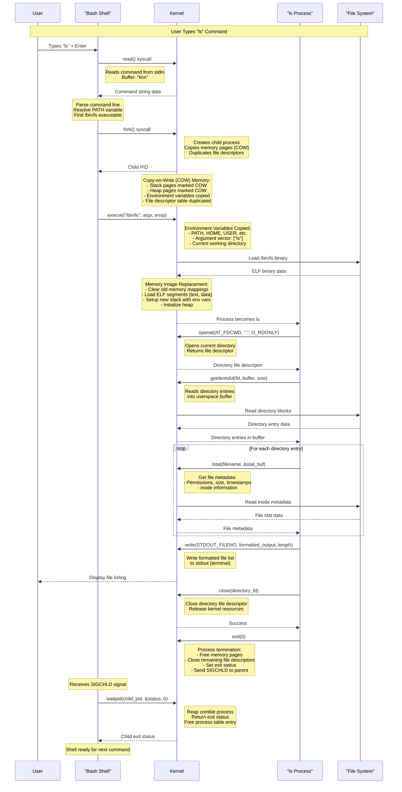

# Bash Process Management: What Happens When You Type "ls"

This document details the complete flow of what happens when you type the `ls` command in bash, including system calls, memory operations, and environment variable handling.

## Process Flow Diagram

## Detailed System Call Breakdown

| Stage | Invoking Process | System Call | Purpose | Memory/Environment Operations |
|-------|------------------|-------------|---------|------------------------------|
| 1. Input | Shell (bash) | `read()` | Reads the command string "ls" from the user's terminal | Command buffered in userspace |
| 2. Process Creation | Shell (bash) | `fork()` | Creates a new child process that is a duplicate of the shell | **COW Memory**: Stack, heap, and data pages marked Copy-on-Write; **Environment**: Full environment copied to child; **File Descriptors**: Descriptor table duplicated |
| 3. Program Loading | Child Process | `execve()` | Replaces the child process's memory image with the /bin/ls program | **Memory Replacement**: Old mappings cleared, ELF segments loaded; **Environment**: Variables (PATH, HOME, USER, etc.) copied to new stack; **Arguments**: argv array setup |
| 4. Directory Reading | ls Process | `openat()` | Opens the current directory and returns a file descriptor | Directory inode loaded into kernel buffer cache |
| 4. Directory Reading | ls Process | `getdents64()` | Reads the contents of the open directory into a buffer | **Memory Copy**: Directory entries copied from kernel space to userspace buffer |
| 4. Metadata Retrieval | ls Process | `lstat()` / `stat()` | Retrieves detailed file information (permissions, size, etc.) for each entry | File metadata copied from inode to userspace stat structure |
| 5. Output | ls Process | `write()` | Writes the formatted list of files to the standard output file descriptor | Output data copied from userspace to kernel buffers, then to terminal |
| 6. Cleanup | ls Process | `close()` | Closes the directory file descriptor | Kernel releases file descriptor and associated resources |
| 7. Termination | ls Process | `exit()` | Terminates the ls process and sets its exit status | **Memory Cleanup**: All process memory pages freed; **Signals**: SIGCHLD sent to parent |
| 8. Synchronization | Shell (bash) | `waitpid()` | Suspends the shell until the ls child process terminates and "reaps" it | Zombie process reaped, exit status retrieved |

## Key Memory Operations

### Copy-on-Write (COW) During fork()
- **Virtual Memory**: Child process gets identical virtual memory layout
- **Physical Memory**: Pages are marked read-only and shared until modified
- **Environment Variables**: Copied immediately to child's address space
- **File Descriptors**: Reference count incremented, table duplicated

### Memory Replacement During execve()
- **Text Segment**: Program code loaded from ELF file
- **Data Segment**: Initialized data loaded
- **BSS Segment**: Uninitialized data zeroed
- **Stack**: New stack created with environment variables and arguments
- **Heap**: Clean heap initialized

### Data Movement
- **Directory Reading**: Kernel copies directory blocks to userspace buffers
- **Metadata Retrieval**: Inode data copied to userspace stat structures
- **Output**: User data copied through kernel buffers to terminal device

## Environment Variable Handling

Environment variables are copied at two critical points:

1. **During fork()**: Complete environment duplicated in child's memory space
2. **During execve()**: Environment variables placed on new process stack

Key variables involved:
- `PATH`: Used to locate the `ls` executable
- `HOME`: User's home directory
- `USER`/`LOGNAME`: Current user identification
- `PWD`: Current working directory
- `TERM`: Terminal type information
- `LANG`/`LC_*`: Localization settings

## Performance Considerations

- **COW Optimization**: Prevents unnecessary memory copying during fork
- **Buffer Cache**: Directory and file metadata cached in kernel
- **System Call Overhead**: Each syscall involves context switch to kernel mode
- **Memory Locality**: Sequential directory reading improves cache performance
