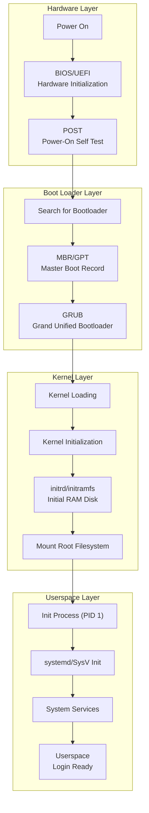
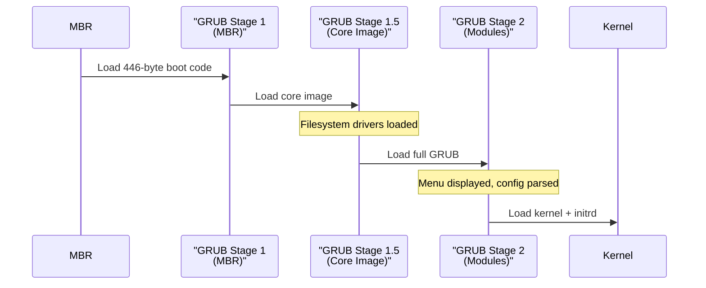
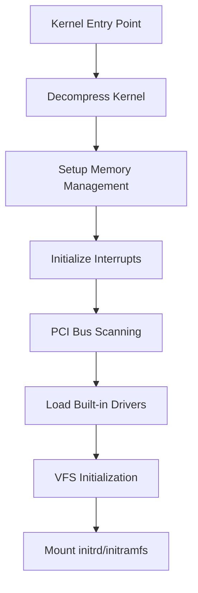
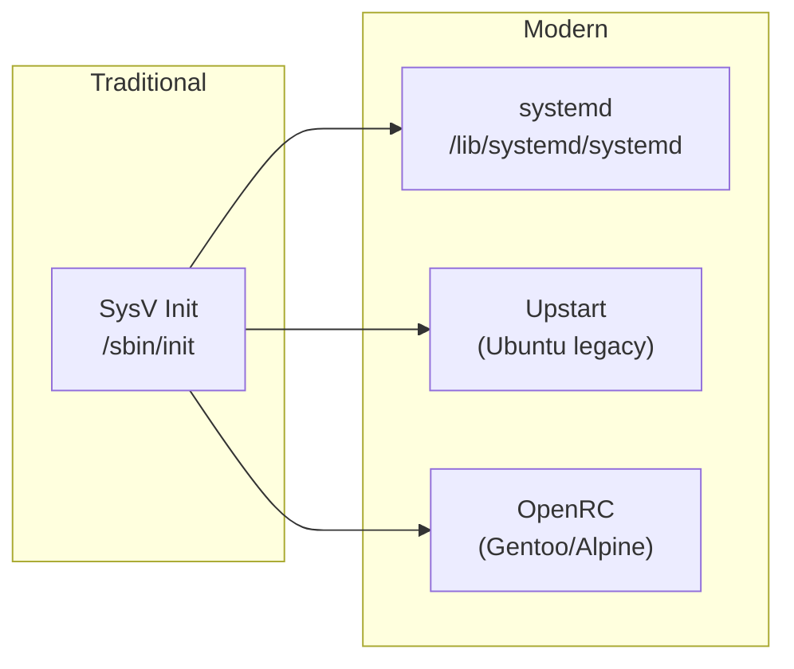
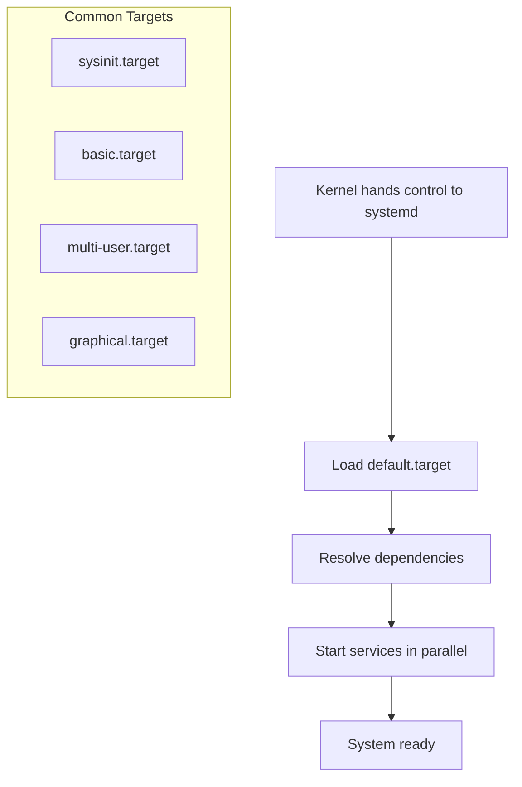
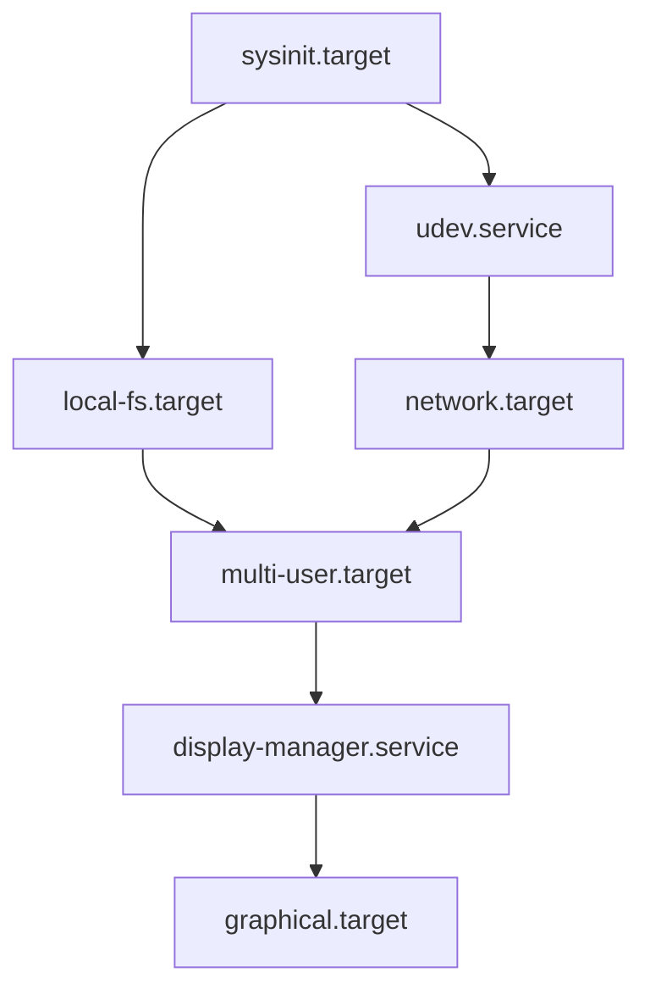

# Linux Boot Process: From Power-On to Userspace

This document provides a comprehensive overview of the Linux boot process, from hardware initialization to a fully operational userspace environment.

## Boot Process Overview

The Linux boot process involves multiple stages, each with specific responsibilities for bringing the system from a powered-off state to a fully functional operating system.



## Detailed Boot Phases

### Phase 1: Hardware Initialization (BIOS/UEFI)

#### BIOS (Basic Input/Output System)
- **Duration**: 1-10 seconds
- **Location**: Firmware stored in motherboard ROM/Flash
- **Purpose**: Initialize hardware components and find bootable device

**What Happens:**
1. **Power-On Reset**: CPU starts at a predefined memory address
2. **Hardware Detection**: Identify and initialize CPU, RAM, storage devices
3. **POST (Power-On Self Test)**: Verify hardware components are functional
4. **Boot Device Selection**: Search for bootable devices in configured order
5. **Load Boot Sector**: Read first 512 bytes (boot sector) from bootable device

**Importance:**
- Provides hardware abstraction layer
- Ensures system hardware is functional
- Establishes boot device priority
- Legacy compatibility for older systems

#### UEFI (Unified Extensible Firmware Interface)
- **Modern replacement** for BIOS
- **Enhanced features**: Secure Boot, larger partition support, graphical interface
- **Boot Process**: Directly loads EFI boot applications

```bash
# View UEFI boot entries (on UEFI systems)
efibootmgr -v

# Check if system uses UEFI or BIOS
ls /sys/firmware/efi  # Directory exists = UEFI
```

### Phase 2: Master Boot Record (MBR) / GPT

#### MBR (Master Boot Record)
- **Size**: 512 bytes
- **Location**: First sector of bootable disk
- **Components**:
  - Boot code (446 bytes)
  - Partition table (64 bytes)
  - Boot signature (2 bytes: 0x55AA)

#### GPT (GUID Partition Table)
- **Modern replacement** for MBR
- **Advantages**: Supports >2TB disks, up to 128 partitions, redundant headers
- **UEFI Integration**: Works seamlessly with UEFI firmware

**Structure Overview:**
```
MBR Layout:
[Boot Code: 446 bytes][Partition Table: 64 bytes][Signature: 2 bytes]

GPT Layout:
[Protective MBR][GPT Header][Partition Entries][Partitions][Backup GPT]
```

**What Happens:**
1. **Load Boot Code**: BIOS loads 446-byte boot program into memory
2. **Parse Partition Table**: Identify active/bootable partition
3. **Chain Loading**: Transfer control to bootloader in active partition
4. **Error Handling**: Display error if no bootable partition found

**Importance:**
- Provides disk partitioning information
- Contains initial boot code
- Determines which partition contains the bootloader
- Maintains backward compatibility

### Phase 3: Bootloader (GRUB)

#### GRUB (Grand Unified Bootloader)
- **Stages**: GRUB Stage 1, Stage 1.5, Stage 2
- **Configuration**: `/boot/grub/grub.cfg`
- **Capabilities**: Multi-OS support, kernel parameter modification, rescue mode

**GRUB Boot Stages:**



**What Happens:**
1. **Stage 1**: MBR loads GRUB Stage 1 (512 bytes)
2. **Stage 1.5**: Loads core image with filesystem drivers
3. **Stage 2**: Full GRUB with menu and configuration
4. **Kernel Selection**: User selects kernel or uses default
5. **Parameter Passing**: Passes kernel parameters and loads initrd
6. **Kernel Transfer**: Transfers control to loaded kernel

**Key Files:**
```bash
/boot/grub/grub.cfg          # Main configuration
/boot/grub/grubenv           # Environment variables
/boot/vmlinuz-*              # Kernel images
/boot/initrd.img-*           # Initial RAM disk images
```

**Importance:**
- Provides boot menu for multiple kernels/OSes
- Allows kernel parameter modification
- Handles kernel and initrd loading
- Provides recovery and rescue capabilities

### Phase 4: Kernel Loading and Initialization

#### Kernel Loading
- **Location**: Typically `/boot/vmlinuz-*`
- **Format**: Compressed kernel image
- **Memory**: Loaded into RAM by GRUB

**What Happens:**
1. **Kernel Decompression**: Decompress kernel image in memory
2. **Memory Setup**: Initialize memory management systems
3. **CPU Initialization**: Set up CPU-specific features
4. **Hardware Detection**: Probe and initialize hardware devices
5. **Driver Loading**: Load built-in device drivers

#### Kernel Initialization Sequence



**Key Subsystems Initialized:**
- **Memory Management**: Virtual memory, page tables
- **Process Scheduler**: CPU scheduling algorithms
- **Interrupt Handling**: IRQ routing and handling
- **Device Drivers**: Storage, network, input devices
- **Filesystem**: VFS (Virtual File System) layer

**Boot Messages:**
```bash
# View kernel boot messages
dmesg | head -50

# Kernel ring buffer
journalctl -k

# Boot log files
/var/log/boot.log
/var/log/messages
```

**Importance:**
- Establishes hardware abstraction layer
- Initializes core system services
- Provides device driver framework
- Sets up memory and process management

### Phase 5: Initial RAM Disk (initrd/initramfs)

#### Purpose and Function
- **Temporary root filesystem** loaded into RAM
- **Contains**: Essential drivers and utilities for mounting real root filesystem
- **Types**: initrd (block device) vs initramfs (cpio archive)

**Why initrd is Needed:**
1. **Chicken-and-egg problem**: Kernel needs drivers to access storage, but drivers may be on storage
2. **Modular kernels**: Keep kernel size small by loading drivers as modules
3. **Complex storage**: RAID, LVM, encrypted filesystems need special handling
4. **Network boot**: Loading root filesystem over network

#### initramfs Structure
```
initramfs/
├── bin/              # Essential binaries (busybox)
├── sbin/             # System binaries
├── lib/              # Shared libraries
├── lib/modules/      # Kernel modules
├── etc/              # Configuration files
├── dev/              # Device files
├── proc/             # Mount point for /proc
├── sys/              # Mount point for /sys
├── init              # Init script
└── scripts/          # Helper scripts
```

**What Happens:**
1. **Mount initramfs**: Kernel mounts initramfs as temporary root
2. **Execute /init**: Run init script in initramfs
3. **Load Modules**: Load necessary kernel modules for storage
4. **Detect Hardware**: Identify storage devices and filesystems
5. **Mount Real Root**: Mount actual root filesystem
6. **Switch Root**: Transfer control to real root filesystem
7. **Cleanup**: Unmount and free initramfs memory

**Common initramfs Tools:**
```bash
# Update initramfs (Debian/Ubuntu)
update-initramfs -u

# Update initramfs (Red Hat/CentOS)
dracut --force

# Extract and examine initramfs
mkdir /tmp/initrd
cd /tmp/initrd
zcat /boot/initrd.img-$(uname -r) | cpio -idmv
```

**Importance:**
- Enables loading of storage drivers as modules
- Supports complex storage configurations
- Provides flexibility for different hardware configurations
- Enables network and remote root filesystems

### Phase 6: Root Filesystem Mount

#### Mounting Process
After initramfs loads necessary drivers, the real root filesystem is mounted.

**Steps:**
1. **Device Detection**: Identify root device (UUID, LABEL, or device path)
2. **Filesystem Check**: Run fsck if needed
3. **Mount Root**: Mount root filesystem (usually read-only first)
4. **Verify Root**: Check that root filesystem contains valid Linux system
5. **Switch Root**: Change from initramfs to real root
6. **Remount**: Remount root filesystem read-write

**Root Filesystem Specification:**
```bash
# In GRUB configuration
root=UUID=12345678-1234-1234-1234-123456789abc
root=LABEL=rootfs
root=/dev/sda1

# View current root filesystem
findmnt /

# View all mounted filesystems
lsblk
mount
```

**fstab Configuration:**
```bash
# /etc/fstab example
UUID=12345678-1234-1234-1234-123456789abc / ext4 defaults 0 1
UUID=87654321-4321-4321-4321-210987654321 /home ext4 defaults 0 2
```

**Importance:**
- Provides persistent storage for the operating system
- Contains all system files and user data
- Establishes the root of the filesystem hierarchy
- Enables proper system operation

### Phase 7: Init Process (PID 1)

#### The First Process
- **PID**: Always 1
- **Parent**: None (created by kernel)
- **Responsibility**: Initialize userspace and manage all other processes

#### Evolution of Init Systems



#### SysV Init (Traditional)
- **Configuration**: `/etc/inittab`
- **Runlevels**: 0-6 with specific purposes
- **Scripts**: `/etc/init.d/` and `/etc/rc*.d/`

**Runlevels:**
```
0 - Halt (shutdown)
1 - Single-user mode (maintenance)
2 - Multi-user mode (no networking)
3 - Multi-user mode (with networking)
4 - Unused (custom)
5 - Graphical mode
6 - Reboot
```

#### systemd (Modern)
- **Configuration**: Unit files in `/etc/systemd/system/` and `/lib/systemd/system/`
- **Targets**: Replace runlevels (multi-user.target, graphical.target)
- **Features**: Parallel startup, dependency management, socket activation

**systemd Boot Process:**


**Key systemd Commands:**
```bash
# View system state
systemctl status

# List all units
systemctl list-units

# Check boot time
systemd-analyze
systemd-analyze blame

# View service dependencies
systemctl list-dependencies graphical.target
```

**What Happens:**
1. **Kernel Handoff**: Kernel executes /sbin/init (usually systemd)
2. **Target Resolution**: Determine default target (usually graphical.target)
3. **Dependency Analysis**: Build dependency tree for required services
4. **Service Startup**: Start services in parallel where possible
5. **Mount Filesystems**: Mount additional filesystems from /etc/fstab
6. **Network Setup**: Configure network interfaces
7. **User Services**: Start user-facing services

**Importance:**
- Manages all system processes
- Provides service dependency management
- Handles system state transitions
- Enables parallel service startup

### Phase 8: System Services

#### Essential Services
Once init is running, various system services are started to provide full functionality.

**Core Services:**
```bash
# Network management
systemctl status NetworkManager
systemctl status networking

# Logging
systemctl status rsyslog
systemctl status systemd-journald

# Time synchronization
systemctl status ntp
systemctl status systemd-timesyncd

# Device management
systemctl status udev

# Display manager (GUI)
systemctl status gdm
systemctl status lightdm
```

#### Service Dependencies



**Service Categories:**
1. **Hardware Services**: udev, hardware detection
2. **Filesystem Services**: filesystem mounting, quota management
3. **Network Services**: networking, DNS, DHCP
4. **Security Services**: firewall, SELinux, AppArmor
5. **Application Services**: web servers, databases, user applications

**Importance:**
- Provides system functionality
- Enables user interaction
- Manages hardware resources
- Supports applications and services

### Phase 9: Userspace Ready

#### Login Ready State
The final phase where the system is ready for user interaction.

**What's Available:**
1. **Login Prompt**: Console or graphical login
2. **Network Connectivity**: Full network stack operational
3. **Hardware Access**: All hardware properly initialized
4. **System Services**: All configured services running
5. **Filesystem Access**: All filesystems mounted and accessible

#### Boot Time Analysis

```bash
# Total boot time
systemd-analyze

# Service startup times
systemd-analyze blame

# Critical path analysis
systemd-analyze critical-chain

# Generate boot chart
systemd-analyze plot > bootchart.svg
```

**Example Output:**
```
Startup finished in 2.547s (firmware) + 1.423s (loader) + 3.891s (kernel) + 4.321s (userspace) = 12.182s
```

## Boot Performance Optimization

### Common Bottlenecks
1. **Hardware initialization**: Slow storage devices
2. **Kernel modules**: Unnecessary driver loading
3. **Service dependencies**: Sequential service startup
4. **Filesystem checks**: Long fsck operations
5. **Network timeouts**: Slow DHCP or DNS resolution

### Optimization Strategies

#### Reduce Boot Services
```bash
# Disable unnecessary services
systemctl disable bluetooth
systemctl disable cups
systemctl disable avahi-daemon

# List enabled services
systemctl list-unit-files --state=enabled
```

#### Parallel Mounting
```bash
# /etc/fstab - add noauto and use systemd mount units
UUID=xxx /home ext4 defaults,noauto 0 2
```

#### Kernel Parameters
```bash
# In GRUB configuration
quiet splash fastboot
```

### Modern Boot Technologies

#### UEFI Secure Boot
- **Purpose**: Verify bootloader and kernel signatures
- **Process**: Chain of trust from firmware to OS
- **Benefits**: Protection against bootkit malware

#### Fast Boot / Quick Boot
- **UEFI Feature**: Skip some hardware initialization
- **OS Integration**: Hibernate-like state preservation
- **Trade-offs**: Reduced hardware compatibility checking

## Troubleshooting Boot Issues

### Common Problems and Solutions

#### Boot Failure at Different Stages

**BIOS/UEFI Issues:**
```bash
# Check boot order in BIOS/UEFI settings
# Verify secure boot settings
# Test with different boot media
```

**GRUB Issues:**
```bash
# Boot from rescue media
# Reinstall GRUB
grub-install /dev/sda
update-grub

# Manually boot from GRUB prompt
grub> ls
grub> set root=(hd0,1)
grub> linux /vmlinuz root=/dev/sda1
grub> initrd /initrd.img
grub> boot
```

**Kernel Issues:**
```bash
# Boot with older kernel
# Check kernel parameters
# Review dmesg output
dmesg | grep -i error
```

**Init Issues:**
```bash
# Boot to single-user mode
# Add 'single' or 'init=/bin/bash' to kernel parameters
# Check systemd journal
journalctl -xb
```

### Recovery Techniques

#### Single User Mode
```bash
# Add to kernel parameters in GRUB
single
# or
init=/bin/bash
```

#### Emergency Mode
```bash
# systemd emergency target
systemctl emergency
# or add to kernel parameters
systemd.unit=emergency.target
```

#### Rescue Mode
```bash
# Boot from installation media
# Mount root filesystem
mount /dev/sda1 /mnt
# Chroot into system
chroot /mnt
```

## Boot Process Summary

| Phase | Component | Duration | Key Function |
|-------|-----------|----------|--------------|
| **1** | BIOS/UEFI | 1-10s | Hardware initialization |
| **2** | MBR/GPT | <1s | Boot sector loading |
| **3** | GRUB | 1-5s | Bootloader and kernel selection |
| **4** | Kernel | 2-10s | OS kernel initialization |
| **5** | initrd/initramfs | 1-5s | Driver loading and root mount |
| **6** | Root Mount | 1-3s | Filesystem mounting |
| **7** | Init (systemd) | 2-15s | System service initialization |
| **8** | Services | 5-30s | Application service startup |
| **9** | Userspace | 1-5s | Login ready state |

**Total typical boot time**: 15-60 seconds (depending on hardware and configuration)

Understanding the Linux boot process is crucial for system administration, troubleshooting boot issues, and optimizing system startup performance. Each phase has specific responsibilities and potential failure points that system administrators should be familiar with.
