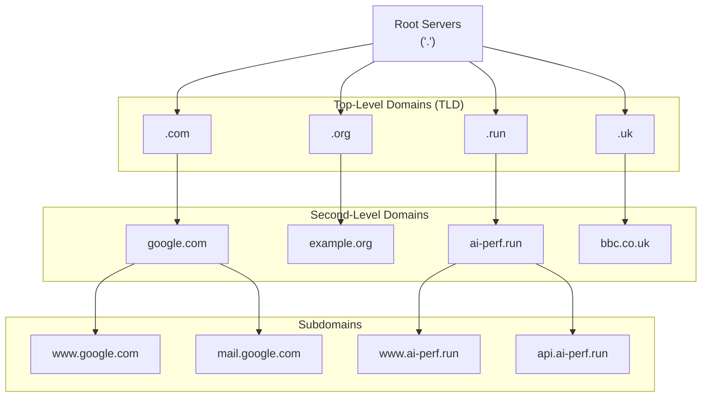
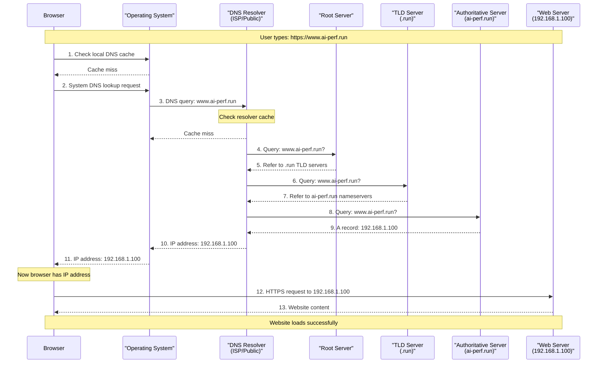
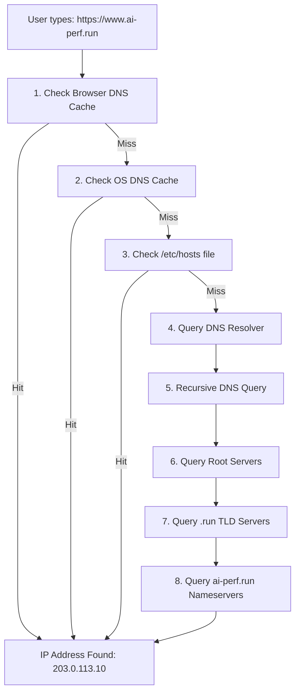
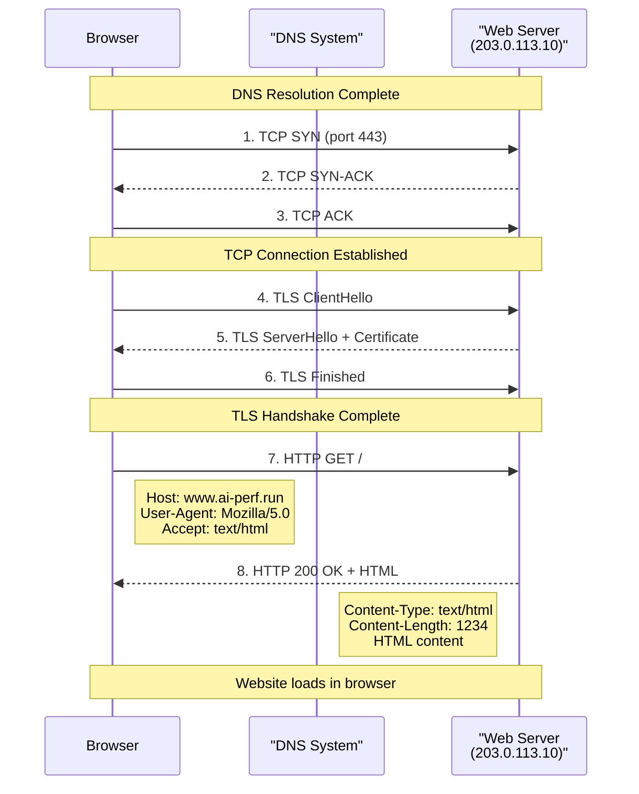
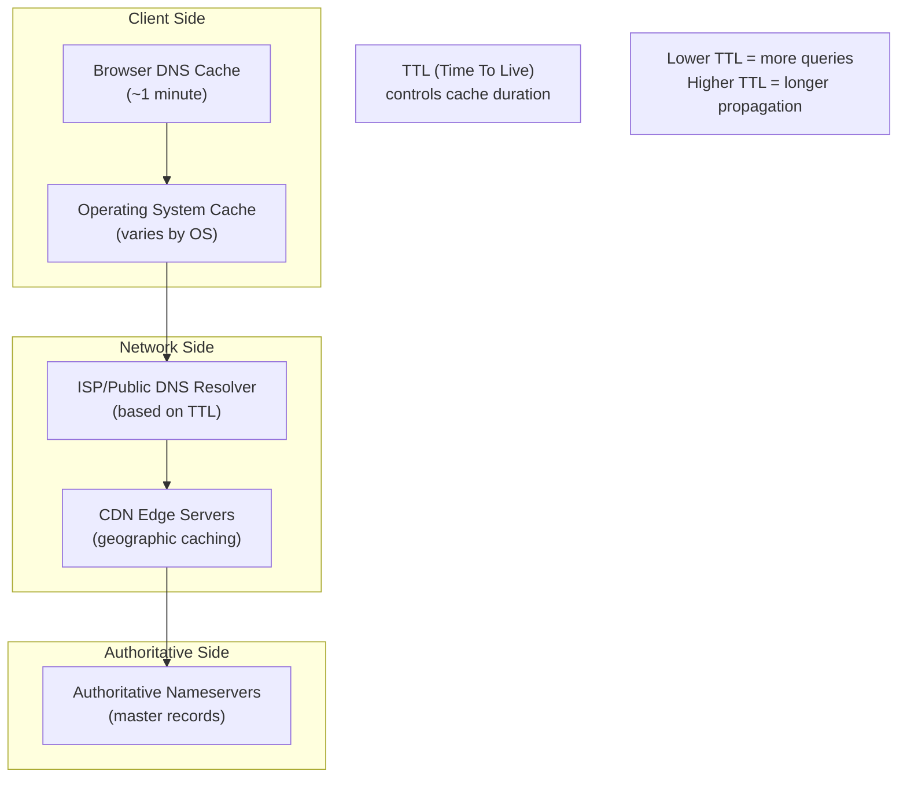

# DNS (Domain Name System): Complete Guide

This document provides a comprehensive overview of DNS, including how it works, different record types, and the complete process from typing a URL to loading a webpage.

## What is DNS?

**DNS (Domain Name System)** is the internet's phone book - a distributed hierarchical system that translates human-readable domain names (like `www.ai-perf.run`) into IP addresses (like `192.168.1.100`) that computers use to communicate. Without DNS, we would need to memorize IP addresses for every website we want to visit.

DNS operates as a **distributed database** with no single point of failure, using a hierarchical structure of servers worldwide to resolve domain names efficiently and reliably.

## DNS Hierarchy Structure



## DNS Resolution Process

When you type `https://www.ai-perf.run` in your browser, here's what happens:



## DNS Record Types

DNS records contain different types of information about domains. Here are the most common types:

### A Record (Address Record)
- **Purpose**: Maps domain name to IPv4 address
- **Format**: `domain.com. 300 IN A 192.168.1.100`
- **Example**: `www.ai-perf.run` → `203.0.113.10`

### AAAA Record (IPv6 Address Record)
- **Purpose**: Maps domain name to IPv6 address
- **Format**: `domain.com. 300 IN AAAA 2001:db8::1`
- **Example**: `www.ai-perf.run` → `2001:db8:85a3::8a2e:370:7334`

### CNAME Record (Canonical Name)
- **Purpose**: Creates an alias from one domain to another
- **Format**: `alias.domain.com. 300 IN CNAME target.domain.com.`
- **Example**: `www.ai-perf.run` → `ai-perf.run`
- **Note**: Cannot coexist with other record types for the same name

### MX Record (Mail Exchange)
- **Purpose**: Specifies mail servers for domain
- **Format**: `domain.com. 300 IN MX 10 mail.domain.com.`
- **Priority**: Lower numbers = higher priority
- **Example**: `ai-perf.run` → `10 mail.ai-perf.run`

### TXT Record (Text Record)
- **Purpose**: Stores arbitrary text data
- **Common uses**: SPF, DKIM, domain verification
- **Format**: `domain.com. 300 IN TXT "v=spf1 include:_spf.google.com ~all"`
- **Example**: Domain ownership verification, email authentication

### NS Record (Name Server)
- **Purpose**: Delegates DNS zone to specific name servers
- **Format**: `domain.com. 300 IN NS ns1.nameserver.com.`
- **Example**: `ai-perf.run` → `ns1.cloudflare.com`


## DNS Record Examples for ai-perf.run

```bash
# A Records - IPv4 addresses
ai-perf.run.              300    IN    A       203.0.113.10
www.ai-perf.run.          300    IN    A       203.0.113.10
api.ai-perf.run.          300    IN    A       203.0.113.20

# AAAA Records - IPv6 addresses
ai-perf.run.              300    IN    AAAA    2001:db8::10
www.ai-perf.run.          300    IN    AAAA    2001:db8::10

# CNAME Records - Aliases
www.ai-perf.run.          300    IN    CNAME   ai-perf.run.
blog.ai-perf.run.         300    IN    CNAME   ai-perf.run.

# MX Records - Mail servers
ai-perf.run.              300    IN    MX      10 mail.ai-perf.run.
ai-perf.run.              300    IN    MX      20 backup-mail.ai-perf.run.

# TXT Records - Various purposes
ai-perf.run.              300    IN    TXT     "v=spf1 include:_spf.google.com ~all"
_dmarc.ai-perf.run.       300    IN    TXT     "v=DMARC1; p=quarantine; rua=mailto:dmarc@ai-perf.run"

# NS Records - Name servers
ai-perf.run.              300    IN    NS      ns1.cloudflare.com.
ai-perf.run.              300    IN    NS      ns2.cloudflare.com.
```

## Complete Browser-to-Website Process

Here's the detailed step-by-step process when someone types `https://www.ai-perf.run`:

### Phase 1: DNS Resolution



### Phase 2: Connection Establishment




## DNS Caching

DNS uses multiple levels of caching to improve performance:

### Caching Hierarchy



### TTL (Time To Live) Values

```bash
# Short TTL (frequent updates)
www.ai-perf.run.    60     IN    A    203.0.113.10

# Medium TTL (balanced)
www.ai-perf.run.    300    IN    A    203.0.113.10

# Long TTL (stable records)
www.ai-perf.run.    3600   IN    A    203.0.113.10
```


## DNS Tools and Commands

### Basic DNS Lookup Tools

```bash
# nslookup - basic DNS lookup
nslookup www.ai-perf.run

# dig - detailed DNS information
dig www.ai-perf.run

# host - simple DNS lookup
host www.ai-perf.run

# Query specific record types
dig www.ai-perf.run A        # A record
dig www.ai-perf.run AAAA     # AAAA record
dig www.ai-perf.run MX       # MX records
dig www.ai-perf.run TXT      # TXT records
dig www.ai-perf.run NS       # NS records

# Trace DNS resolution path
dig +trace www.ai-perf.run

# Query specific DNS server
dig @8.8.8.8 www.ai-perf.run
```

### Advanced DNS Diagnostics

```bash
# Check DNS propagation
dig @8.8.8.8 www.ai-perf.run        # Google DNS
dig @1.1.1.1 www.ai-perf.run        # Cloudflare DNS
dig @208.67.222.222 www.ai-perf.run # OpenDNS

# Get all records for a domain
dig www.ai-perf.run ANY
```

## DNS Performance Optimization

### Best Practices

1. **Use appropriate TTL values**:
   - Short TTL (60-300s) for records that change frequently
   - Long TTL (3600-86400s) for stable records

2. **Implement DNS prefetching**:
   ```html
   <link rel="dns-prefetch" href="//cdn.ai-perf.run">
   <link rel="dns-prefetch" href="//api.ai-perf.run">
   ```

3. **Use CDN with DNS optimization**:
   - Geographic DNS resolution
   - Anycast DNS servers
   - Edge caching

4. **Monitor DNS performance**:
   - Query response times
   - Cache hit rates
   - DNS server availability

### DNS Load Balancing

```bash
# Multiple A records for load balancing
www.ai-perf.run.    300    IN    A    203.0.113.10
www.ai-perf.run.    300    IN    A    203.0.113.11
www.ai-perf.run.    300    IN    A    203.0.113.12

# Geographic load balancing with different TTLs
# US users get different IPs than EU users
```

## Common DNS Issues and Troubleshooting

### Troubleshooting Steps

1. **Check local DNS cache**:
   ```bash
   # Clear DNS cache
   sudo systemctl flush-dns        # Linux
   ipconfig /flushdns              # Windows
   sudo dscacheutil -flushcache    # macOS
   ```

2. **Test different DNS servers**:
   ```bash
   # Test with different DNS providers
   dig @8.8.8.8 www.ai-perf.run    # Google
   dig @1.1.1.1 www.ai-perf.run    # Cloudflare
   dig @208.67.222.222 www.ai-perf.run # OpenDNS
   ```

3. **Check DNS propagation**:
   ```bash
   # Check if changes have propagated globally
   dig +trace www.ai-perf.run
   ```

4. **Verify DNS records**:
   ```bash
   # Check all DNS records for domain
   dig www.ai-perf.run ANY
   ```

### Common DNS Problems

| Problem | Symptoms | Solution |
|---------|----------|----------|
| **DNS Cache Issues** | Old IP returned | Clear DNS cache |
| **Propagation Delay** | Inconsistent results | Wait for TTL expiration |
| **Wrong DNS Server** | Incorrect records | Check DNS server configuration |
| **DNSSEC Validation** | Resolution fails | Verify DNSSEC chain |
| **Network Issues** | Timeouts | Check network connectivity |

## DNS and Website Performance

The DNS resolution process directly impacts website loading speed:

### Performance Metrics

- **DNS Lookup Time**: Time to resolve domain to IP
- **Connection Time**: Time to establish TCP connection
- **SSL Handshake**: Time for TLS negotiation
- **First Byte Time**: Time to receive first response byte

### Optimization Strategies

1. **Reduce DNS lookups**: Minimize external domains
2. **Use DNS prefetching**: Resolve domains before needed
3. **Choose fast DNS providers**: Use performance-optimized DNS
4. **Implement proper caching**: Set appropriate TTL values
5. **Monitor DNS performance**: Track resolution times

## Summary

DNS is a critical component of internet infrastructure that:

1. **Translates domain names** to IP addresses through a hierarchical system
2. **Uses multiple record types** (A, AAAA, CNAME, MX, TXT, NS) for different purposes
3. **Employs caching** at multiple levels to improve performance
4. **Requires security measures** like DNSSEC to prevent attacks
5. **Directly impacts** website performance and user experience

Understanding DNS is essential for web developers, system administrators, and anyone working with internet infrastructure. Proper DNS configuration and optimization can significantly improve website performance and reliability.

When someone types `https://www.ai-perf.run`, the entire process from DNS resolution to website loading involves multiple systems working together to deliver the final webpage to the user's browser.
