# Linux Memory Organization

This document provides a comprehensive explanation of Linux memory organization, from high-level concepts like main memory and swap to low-level details including memory lists, TLB, and huge pages.

## Memory Hierarchy Overview

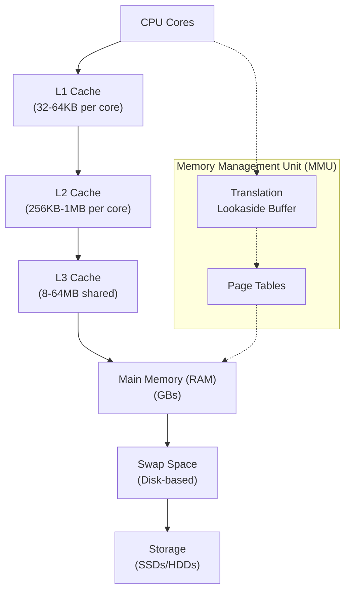

## Main Memory and Swap

### Physical Memory (RAM)

Physical memory in Linux is organized into **pages** (typically 4KB on x86/x64 systems). The kernel manages these pages through several data structures and algorithms.

#### Memory Zones

Linux divides physical memory into zones based on hardware limitations:

1. **ZONE_DMA** (0-16MB): For devices that can only access lower 16MB
2. **ZONE_DMA32** (0-4GB): For 32-bit DMA devices on 64-bit systems
3. **ZONE_NORMAL**: Regular memory that can be directly mapped
4. **ZONE_HIGHMEM**: Memory above kernel's direct mapping (32-bit systems)
5. **ZONE_MOVABLE**: Memory that can be migrated or reclaimed

### Virtual Memory System

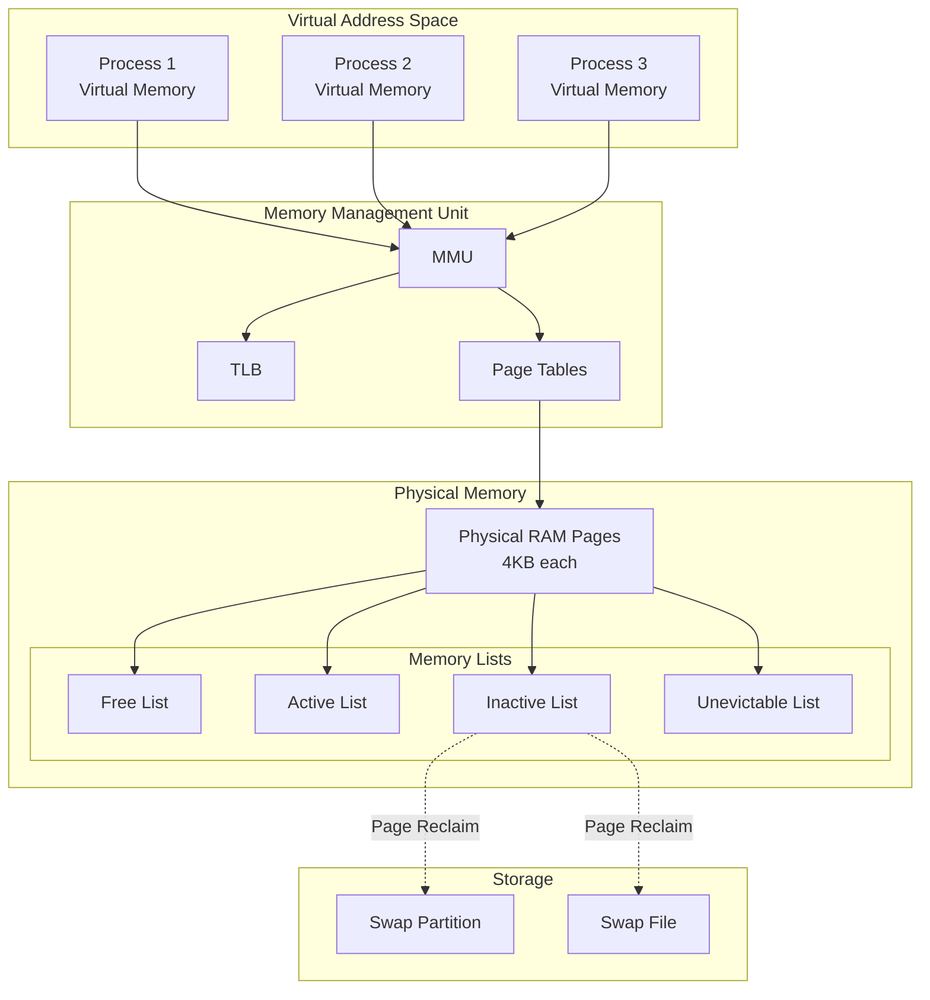

### Swap Space

Swap space extends physical memory by using disk storage. Linux supports:

1. **Swap Partitions**: Dedicated disk partitions
2. **Swap Files**: Regular files used as swap space

#### Swap Management
- **Swappiness**: Controls how aggressively the kernel swaps pages (0-100)
- **Page Replacement**: Uses algorithms like LRU (Least Recently Used)
- **Swap Cache**: Keeps recently swapped pages in memory for quick access

## Understanding vmstat Output

The `vmstat` command provides detailed information about virtual memory, processes, and system activity.

### Sample vmstat Output
```
procs -----------memory---------- ---swap-- -----io---- -system-- ------cpu-----
 r  b   swpd   free   buff  cache   si   so    bi    bo   in   cs us sy id wa st
 2  0  12432  89536  15632 185632    0    2    45    12  125  203  5  2 92  1  0
```

### Detailed Field Explanation

#### Process Fields
- **r**: Number of runnable processes (running or waiting for CPU)
- **b**: Number of processes blocked waiting for I/O

#### Memory Fields (in KB)
- **swpd**: Amount of virtual memory used (swap space used)
- **free**: Amount of idle memory
- **buff**: Amount of memory used as buffers
- **cache**: Amount of memory used as cache

#### Swap Fields (in KB/s)
- **si**: Memory swapped in from disk (swap in)
- **so**: Memory swapped out to disk (swap out)

#### I/O Fields (blocks/s)
- **bi**: Blocks received from block devices (read)
- **bo**: Blocks sent to block devices (write)

#### System Fields
- **in**: Interrupts per second
- **cs**: Context switches per second

#### CPU Fields (percentages)
- **us**: User time (time spent running user processes)
- **sy**: System time (time spent in kernel)
- **id**: Idle time
- **wa**: Wait time (waiting for I/O)
- **st**: Stolen time (time stolen by hypervisor)

### Memory States Analysis

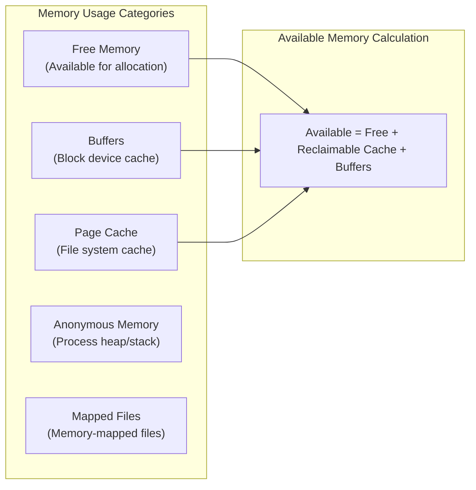

## Memory Lists in Detail

The Linux kernel maintains several lists to track page states and optimize memory allocation and reclamation.

### Page Frame States

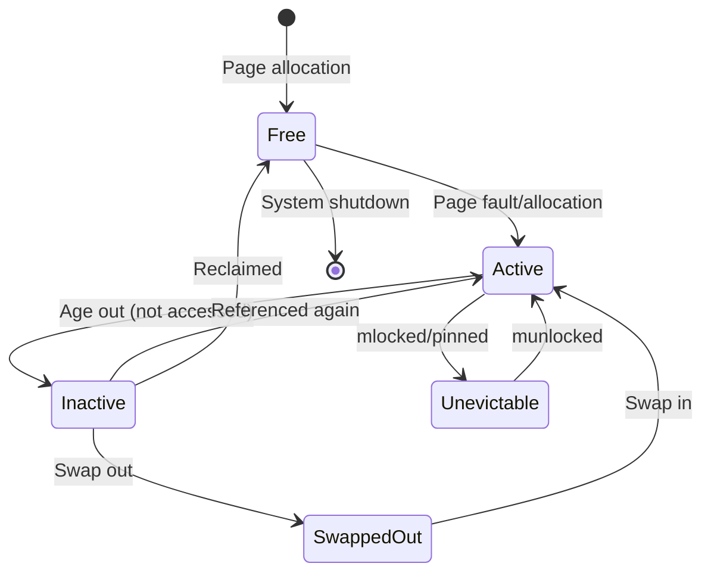

### Memory List Types

#### 1. Free List
- **Purpose**: Tracks completely unused pages
- **Management**: Buddy allocator system
- **Organization**: Power-of-2 sized blocks (1, 2, 4, 8, 16... pages)
- **Access**: O(log n) allocation and deallocation

#### 2. Active List (LRU Active)
- **Purpose**: Recently accessed pages likely to be accessed again
- **Characteristics**: 
  - Not candidates for immediate reclaim
  - Protected from page replacement
  - Split into anonymous and file-backed pages

#### 3. Inactive List (LRU Inactive)
- **Purpose**: Candidates for page reclamation
- **Characteristics**:
  - Haven't been accessed recently
  - First target for memory reclamation
  - Also split into anonymous and file-backed pages

#### 4. Unevictable List
- **Purpose**: Pages that cannot be reclaimed
- **Contents**:
  - mlocked pages (locked in memory)
  - Kernel pages
  - Pages with elevated reference counts
  - Shared memory segments marked as locked

### Page Replacement Algorithm (LRU)

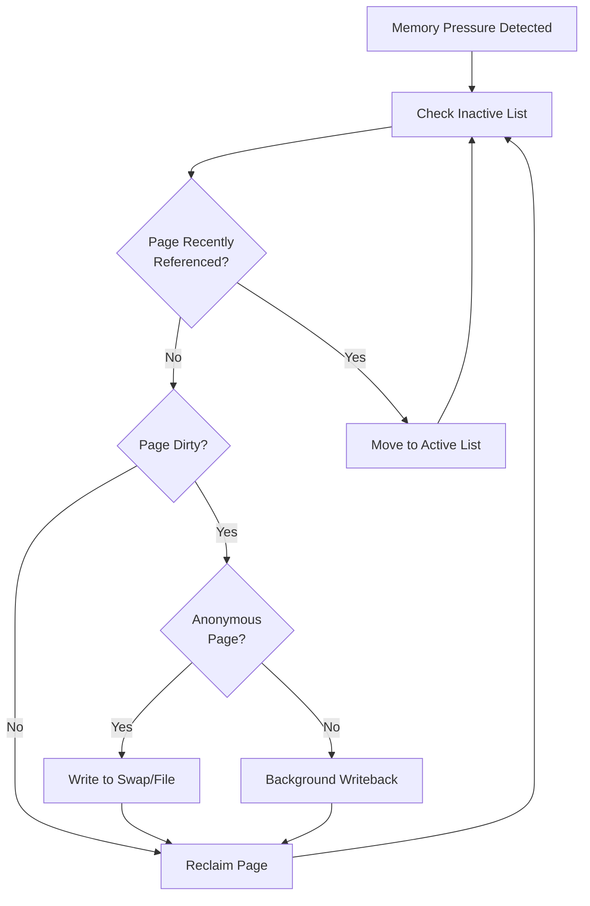

## Translation Lookaside Buffer (TLB)

The TLB is a critical hardware component that caches virtual-to-physical address translations to improve memory access performance.

### TLB Architecture

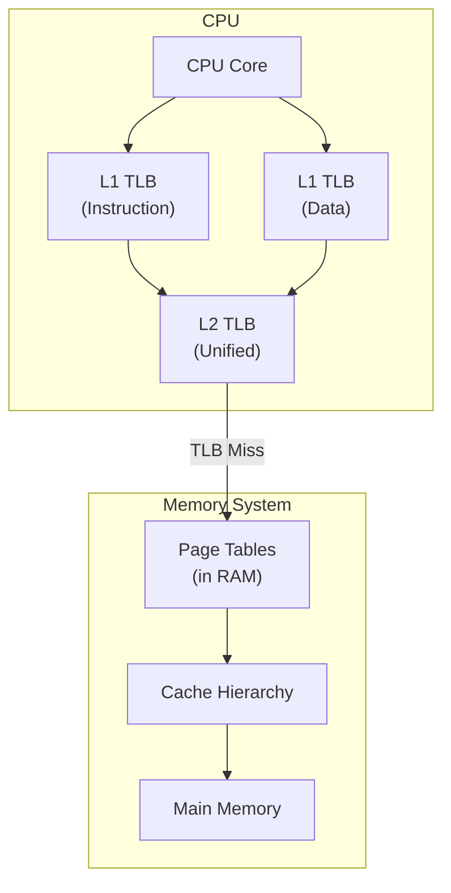

### TLB Operation Details

#### TLB Hit Process
1. **Virtual Address** presented to TLB
2. **TLB Lookup** using virtual page number
3. **Physical Address** returned immediately
4. **Memory Access** proceeds with physical address

#### TLB Miss Process
1. **TLB Miss** detected
2. **Page Table Walk** initiated
3. **Hardware/Software** walks page tables
4. **Translation Found** and loaded into TLB
5. **Memory Access** retried

### TLB Performance Characteristics

| TLB Level | Size | Access Time | Coverage |
|-----------|------|-------------|----------|
| L1 ITLB | 32-128 entries | 1 cycle | 128KB-512KB |
| L1 DTLB | 64-128 entries | 1 cycle | 256KB-512KB |
| L2 TLB | 512-1536 entries | 2-6 cycles | 2MB-6MB |
| Page Walk | N/A | 100+ cycles | Full memory |

### TLB Management

#### TLB Invalidation
- **Process Switch**: Flush entire TLB (expensive)
- **Address Space ID (ASID)**: Tag TLB entries to avoid flushes
- **Page Unmap**: Invalidate specific entries
- **Global Pages**: Kernel pages marked as global (not flushed)

#### TLB Shootdown
When one CPU modifies page tables, other CPUs must invalidate their TLBs:

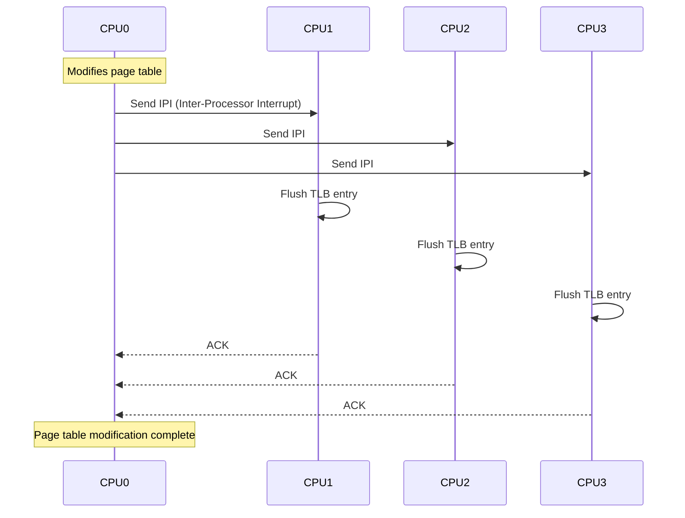

## Huge Pages

Huge pages reduce TLB pressure by using larger page sizes, improving performance for memory-intensive applications.

### Standard vs Huge Pages

| Page Type | Size (x86_64) | TLB Entries | Coverage per Entry |
|-----------|---------------|-------------|-------------------|
| Standard | 4KB | 1 | 4KB |
| Huge Page | 2MB | 1 | 2MB |
| Gigantic Page | 1GB | 1 | 1GB |

### Huge Page Benefits

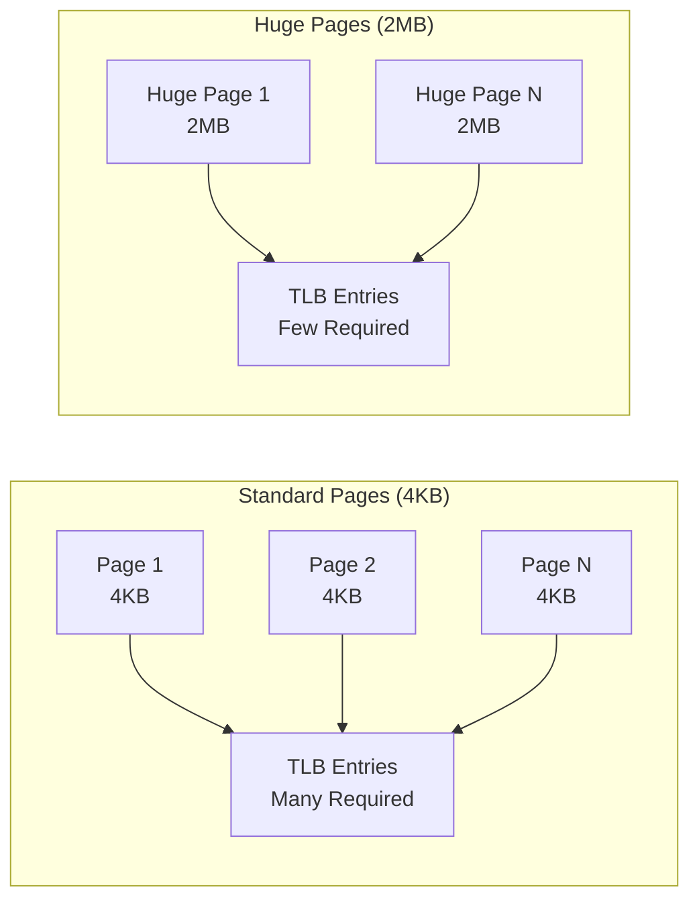

### Types of Huge Pages

#### 1. Static Huge Pages
- **Allocation**: At boot time or runtime via sysfs
- **Management**: Kernel maintains huge page pool
- **Usage**: Applications must explicitly request
- **Configuration**: `/proc/sys/vm/nr_hugepages`

#### 2. Transparent Huge Pages (THP)
- **Allocation**: Automatic by kernel
- **Management**: Dynamic allocation and deallocation
- **Usage**: Transparent to applications
- **Types**: 
  - **always**: Always try to use huge pages
  - **madvise**: Only for regions marked with `madvise()`
  - **never**: Disabled

### Huge Page Management

#### Huge Page Pool
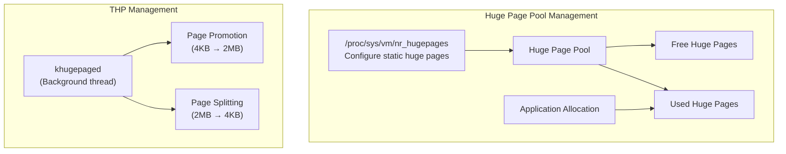

#### THP Operation

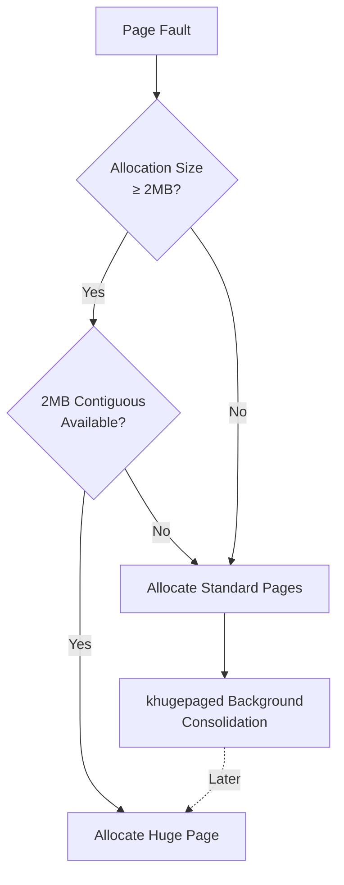

### Memory Fragmentation and Huge Pages

#### External Fragmentation Problem
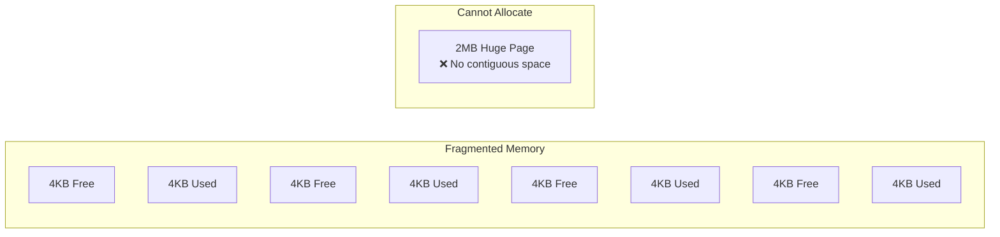

#### Memory Compaction
The kernel performs memory compaction to create contiguous memory regions:

1. **Migration**: Move pages to create contiguous regions
2. **Defragmentation**: Consolidate free pages
3. **Compaction Zones**: Focus on specific memory zones

### Huge Page Performance Impact

#### TLB Performance Comparison
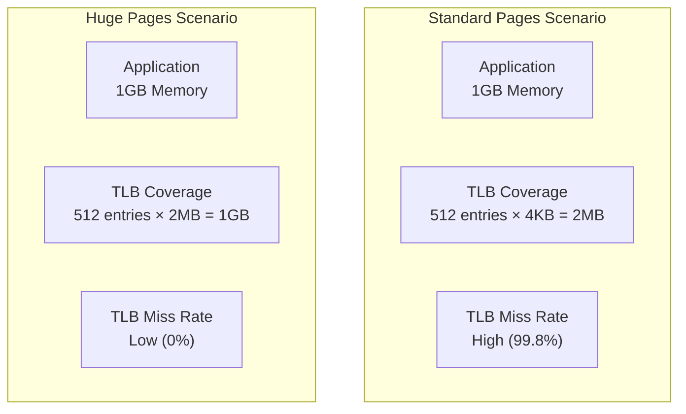

## Memory Performance Monitoring

### Key Metrics to Monitor

#### vmstat Extended Analysis
```bash
# Monitor memory pressure
vmstat 1

# Key indicators:
# - si/so > 0: Swapping activity (performance issue)
# - free < 5% total: Memory pressure
# - buff/cache high: Good (unused memory used for caching)
# - wa > 10%: I/O wait time high
```

#### Memory Information Sources
1. **`/proc/meminfo`**: Detailed memory statistics
2. **`/proc/vmstat`**: Virtual memory statistics
3. **`/proc/buddyinfo`**: Buddy allocator information
4. **`/proc/pagetypeinfo`**: Page type information
5. **`/sys/kernel/mm/hugepages/`**: Huge page statistics

### Memory Pressure Indicators

#### Signs of Memory Pressure
1. **High swap usage** (si/so in vmstat)
2. **Low free memory** with **high pressure**
3. **Frequent page reclaim** activity
4. **High system CPU usage** due to memory management
5. **Increased I/O wait time**

#### Memory Reclaim Process
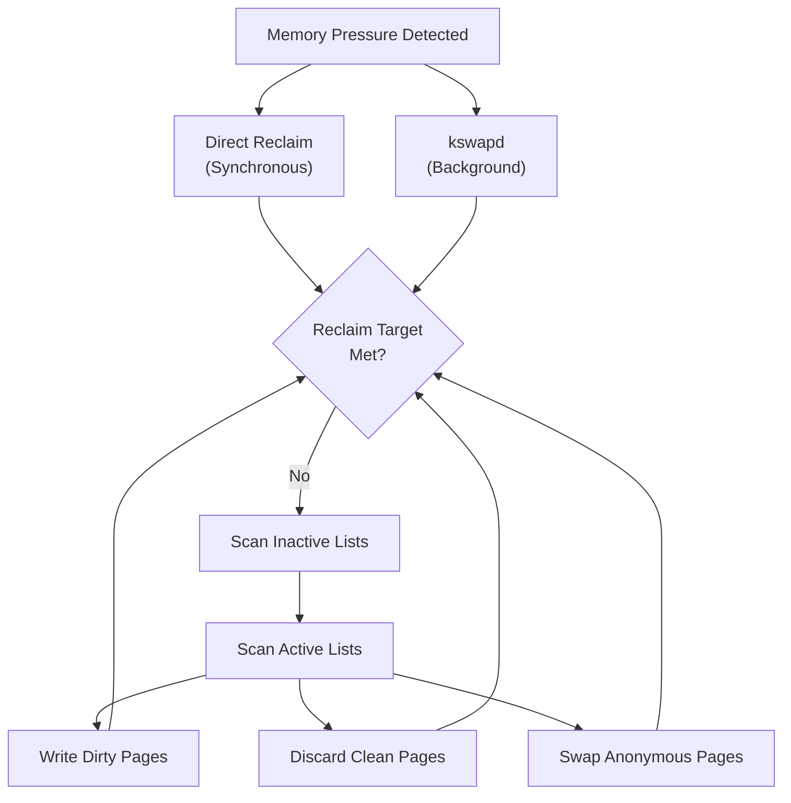

## Best Practices and Optimization

### Memory Optimization Guidelines

#### 1. Application Level
- **Memory Pools**: Reduce allocation/deallocation overhead
- **NUMA Awareness**: Allocate memory on local NUMA nodes
- **Huge Pages**: Use for large memory allocations
- **Memory Mapping**: Use mmap for large files

#### 2. System Level
- **Swappiness Tuning**: Adjust `/proc/sys/vm/swappiness`
- **Huge Page Configuration**: Configure appropriate huge page pool
- **NUMA Policy**: Set appropriate NUMA memory policies
- **Memory Overcommit**: Configure `/proc/sys/vm/overcommit_memory`

#### 3. Monitoring and Troubleshooting
- **Regular Monitoring**: Use vmstat, free, /proc/meminfo
- **Memory Profiling**: Use tools like valgrind, AddressSanitizer
- **Performance Analysis**: Monitor TLB misses, cache misses
- **Memory Leaks**: Regular memory leak detection

### Common Memory Issues and Solutions

| Issue | Symptoms | Solutions |
|-------|----------|-----------|
| **Memory Fragmentation** | Huge page allocation failures | Memory compaction, restart services |
| **Memory Leaks** | Gradual memory increase | Memory profiling, code review |
| **High Swap Usage** | Poor performance, high I/O | Add RAM, optimize applications |
| **TLB Thrashing** | High CPU, poor cache performance | Enable huge pages, reduce memory working set |
| **NUMA Imbalance** | Uneven memory usage | NUMA-aware allocation, process binding |

This comprehensive guide covers the essential aspects of Linux memory organization, from basic concepts to advanced topics like TLB management and huge pages, providing both theoretical understanding and practical insights for system administrators and developers.
