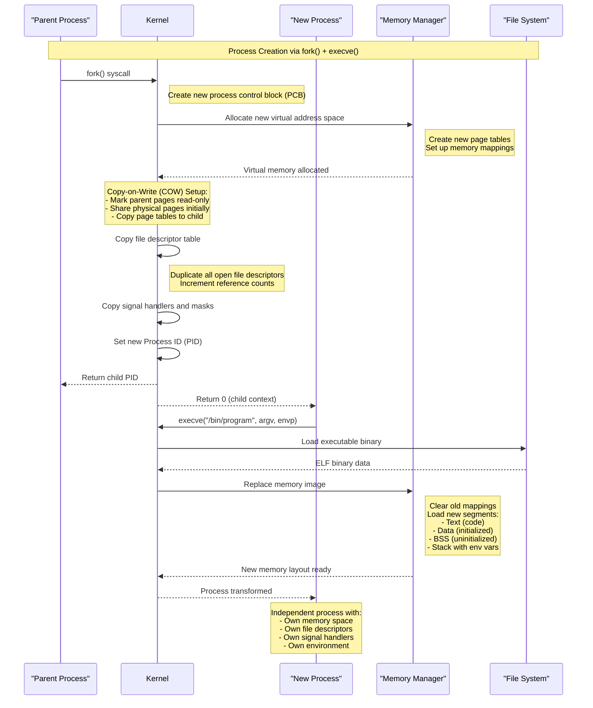
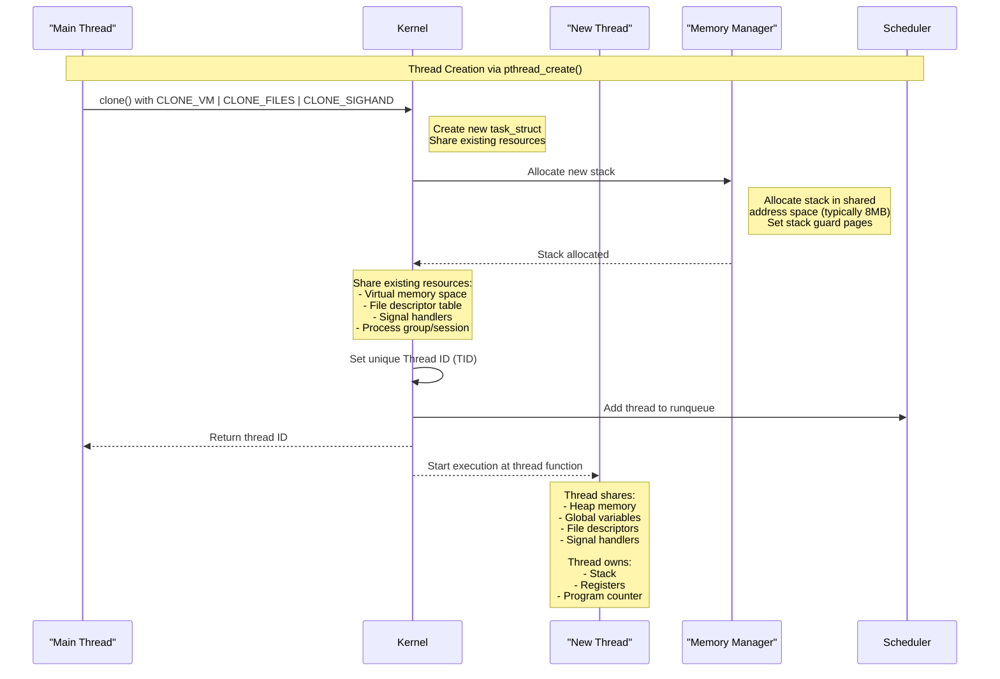
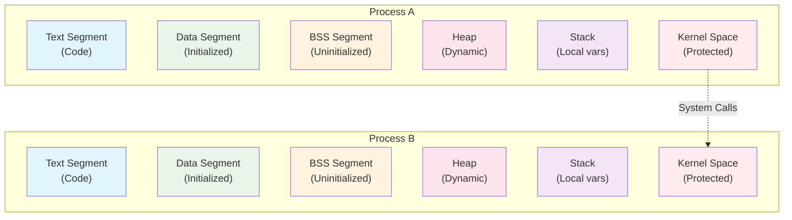
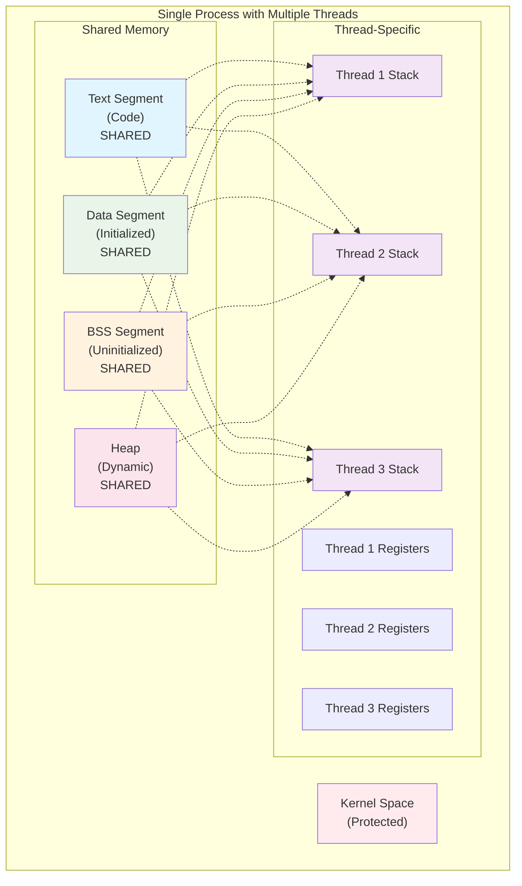

# Process vs Thread: Comprehensive Comparison

This document provides a detailed comparison between processes and threads, including their creation, memory management, communication mechanisms, and performance characteristics.

## Fundamental Differences

### Process
A **process** is an independent execution unit that contains its own memory space, file descriptors, and system resources. Each process runs in isolation from other processes, providing strong security boundaries.

### Thread
A **thread** is a lightweight execution unit within a process that shares the process's memory space and resources. Multiple threads can exist within a single process and execute concurrently.

## Process Creation Flow

## Thread Creation Flow

## Memory Architecture Comparison

### Process Memory Layout

### Thread Memory Layout

## Communication Mechanisms

### Process Communication (IPC)

Processes require special Inter-Process Communication (IPC) mechanisms:

1. **Pipes**: Unidirectional data flow between related processes
2. **Named Pipes (FIFOs)**: Bidirectional communication between unrelated processes
3. **Message Queues**: Structured message passing
4. **Shared Memory**: High-performance shared memory segments
5. **Semaphores**: Synchronization primitives
6. **Sockets**: Network-based communication (local or remote)
7. **Signals**: Asynchronous event notification

### Thread Communication

Threads share memory space, enabling direct communication:

1. **Shared Variables**: Direct access to global variables and heap
2. **Mutexes**: Mutual exclusion for critical sections
3. **Condition Variables**: Wait/signal mechanisms
4. **Semaphores**: Counting semaphores for resource management
5. **Read-Write Locks**: Multiple readers, single writer
6. **Atomic Operations**: Lock-free synchronization
7. **Thread-Local Storage**: Per-thread private data

## Detailed Comparison

### Resource Ownership

#### Process Resources
- **Virtual Memory Space**: Each process has its own virtual address space (typically 4GB on 32-bit, much larger on 64-bit)
- **File Descriptors**: Independent file descriptor table
- **Signal Handlers**: Process-specific signal handling
- **Environment Variables**: Private copy of environment
- **Working Directory**: Each process maintains its own current directory
- **Process Group**: Belongs to a specific process group and session

#### Thread Resources
- **Shared Resources**:
  - Virtual memory space (text, data, BSS, heap)
  - File descriptors
  - Signal handlers
  - Environment variables
  - Working directory
  - Process and group IDs

- **Private Resources**:
  - Stack (typically 8MB per thread)
  - Registers and program counter
  - Thread-local storage
  - Signal mask
  - Scheduling priority

### Creation Overhead

#### Process Creation
- **System Call**: `fork()` followed by optional `execve()`
- **Memory Operations**: 
  - Copy page tables (COW optimization)
  - Allocate new virtual address space
  - Set up memory mappings
- **Resource Duplication**:
  - File descriptor table
  - Signal handlers
  - Environment variables
- **Time Complexity**: O(n) where n is the number of memory mappings
- **Typical Cost**: 1000-10000 CPU cycles

#### Thread Creation
- **System Call**: `clone()` with specific flags
- **Memory Operations**:
  - Allocate new stack (single allocation)
  - No virtual memory duplication
- **Resource Sharing**: Point to existing resources
- **Time Complexity**: O(1) - constant time
- **Typical Cost**: 100-1000 CPU cycles

### Context Switching

#### Process Context Switch
1. **Save current process state** (registers, program counter)
2. **Switch page tables** (flush TLB - Translation Lookaside Buffer)
3. **Update memory management unit** (MMU)
4. **Switch kernel stack**
5. **Restore new process state**
6. **Typical Cost**: 1000-10000 CPU cycles

#### Thread Context Switch
1. **Save current thread state** (registers, program counter)
2. **Keep same page tables** (no TLB flush needed)
3. **Switch stack pointer**
4. **Restore new thread state**
5. **Typical Cost**: 100-1000 CPU cycles

### Security and Isolation

#### Process Isolation
- **Memory Protection**: Complete memory isolation via virtual memory
- **Fault Isolation**: Crash in one process doesn't affect others
- **Resource Limits**: Per-process resource limits (CPU, memory, files)
- **Security Boundaries**: Different processes can run as different users
- **Debugging**: Easier to debug - isolated state

#### Thread Isolation
- **Shared Memory**: All threads share memory - potential for interference
- **Fault Propagation**: Crash in one thread terminates entire process
- **Resource Sharing**: Resource limits apply to entire process
- **Security Risks**: All threads run with same privileges
- **Debugging Complexity**: Harder to debug due to shared state

## Performance Characteristics

### Memory Usage

#### Processes
- **Per-process overhead**: ~8MB virtual memory minimum
- **Page tables**: Separate page tables per process
- **Kernel structures**: Process control block (PCB), memory descriptors
- **File descriptors**: Separate file descriptor table

#### Threads
- **Per-thread overhead**: ~8MB stack + small kernel structure
- **Shared page tables**: Single set of page tables for all threads
- **Minimal kernel overhead**: Shared process resources
- **Shared file descriptors**: Single file descriptor table

### Scalability

#### Process Scalability
- **Memory limits**: Limited by virtual memory space
- **System limits**: Kernel process table size
- **Creation cost**: High creation overhead
- **Typical limit**: Thousands of processes

#### Thread Scalability
- **Memory limits**: Limited by stack space allocation
- **System limits**: Thread limit per process and system-wide
- **Creation cost**: Low creation overhead
- **Typical limit**: Tens of thousands of threads

## Summary Comparison Table

| Aspect | Process | Thread |
|--------|---------|--------|
| **Memory Space** | Separate virtual address space | Shared virtual address space |
| **Creation Cost** | High (1000-10000 cycles) | Low (100-1000 cycles) |
| **Context Switch** | Expensive (TLB flush required) | Cheap (no TLB flush) |
| **Communication** | IPC mechanisms required | Direct memory access |
| **Synchronization** | IPC synchronization | Mutexes, condition variables |
| **Fault Isolation** | Complete isolation | Shared fate |
| **Security** | Strong isolation | Shared security context |
| **Debugging** | Easier (isolated state) | Complex (shared state) |
| **Resource Overhead** | ~8MB+ per process | ~8MB stack per thread |
| **Scalability** | Thousands | Tens of thousands |
| **Portability** | Universal support | POSIX threads |
| **Use Case** | Independent tasks | Concurrent subtasks |

## When to Use Each

### Choose Processes When:
- **Strong isolation** is required
- **Security boundaries** are important
- **Fault tolerance** is critical
- Tasks are **largely independent**
- **Different privilege levels** are needed
- **Debugging simplicity** is important

### Choose Threads When:
- **High performance** communication is needed
- **Shared data** is common
- **Low creation overhead** is important
- Tasks are **tightly coupled**
- **Memory efficiency** is critical
- **Fine-grained parallelism** is required

## Best Practices

### Process Best Practices
1. **Minimize IPC overhead** - use appropriate IPC mechanism
2. **Handle signals properly** - implement signal handlers
3. **Resource cleanup** - always wait for child processes
4. **Error handling** - check return values of system calls
5. **Security** - drop privileges when not needed

### Thread Best Practices
1. **Synchronization** - always protect shared data
2. **Deadlock prevention** - consistent lock ordering
3. **Thread-safe libraries** - use reentrant functions
4. **Resource management** - join or detach threads
5. **Signal handling** - designate signal handling thread
6. **Stack size** - adjust stack size if needed
