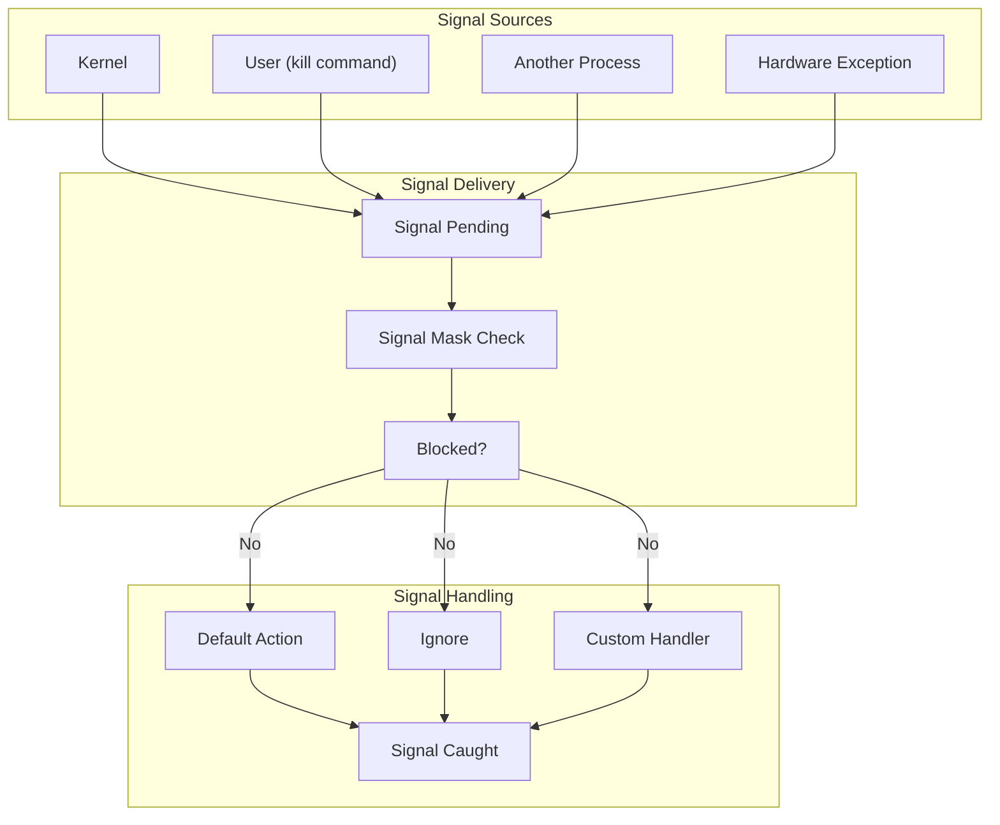
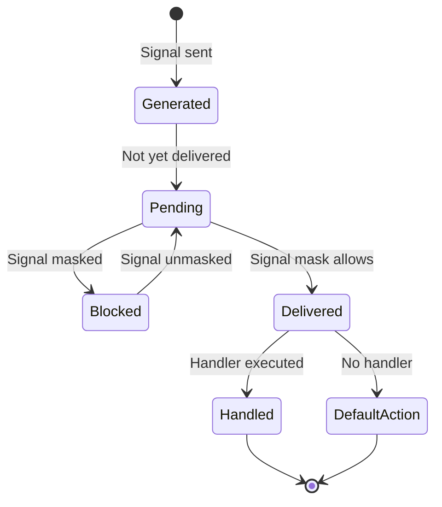

# Linux Signals: Complete Guide

This document provides a comprehensive overview of Linux signals, including key signals, signal handlers, masking, and practical examples.

## What are Signals?

Signals are software interrupts that provide a way for processes to communicate asynchronously. They are used to notify processes about events that have occurred in the system.

## Signal Flow Overview



## Key Signals

### Process Control Signals

#### SIGTERM (15) - Termination Request
- **Purpose**: Polite request to terminate
- **Default Action**: Terminate process
- **Can be caught**: Yes
- **Usage**: Graceful shutdown

```bash
# Send SIGTERM to process
kill 1234
kill -TERM 1234
kill -15 1234
```

#### SIGKILL (9) - Force Kill
- **Purpose**: Immediate termination
- **Default Action**: Terminate process
- **Can be caught**: No (cannot be blocked or ignored)
- **Usage**: Force termination when SIGTERM fails

```bash
# Send SIGKILL to process
kill -9 1234
kill -KILL 1234
```

#### SIGINT (2) - Interrupt
- **Purpose**: Interrupt from keyboard (Ctrl+C)
- **Default Action**: Terminate process
- **Can be caught**: Yes
- **Usage**: User-initiated termination

#### SIGQUIT (3) - Quit
- **Purpose**: Quit from keyboard (Ctrl+\)
- **Default Action**: Terminate process and core dump
- **Can be caught**: Yes
- **Usage**: Generate core dump for debugging

### Job Control Signals

#### SIGSTOP (19) - Stop Process
- **Purpose**: Suspend process execution
- **Default Action**: Stop process
- **Can be caught**: No (cannot be blocked or ignored)
- **Usage**: Pause process execution

```bash
# Stop a process
kill -STOP 1234
```

#### SIGTSTP (20) - Terminal Stop
- **Purpose**: Stop from terminal (Ctrl+Z)
- **Default Action**: Stop process
- **Can be caught**: Yes
- **Usage**: Suspend foreground job

#### SIGCONT (18) - Continue
- **Purpose**: Resume stopped process
- **Default Action**: Continue execution
- **Can be caught**: Yes
- **Usage**: Resume suspended process

```bash
# Resume a stopped process
kill -CONT 1234
fg  # Resume in foreground
bg  # Resume in background
```

### Process Lifecycle Signals

#### SIGCHLD (17) - Child Status Changed
- **Purpose**: Child process terminated, stopped, or continued
- **Default Action**: Ignore
- **Can be caught**: Yes
- **Usage**: Parent process notification

```bash
#!/bin/bash
# Example: Handling SIGCHLD in bash

sigchld_handler() {
    echo "Child process finished"
    wait  # Clean up any zombie processes
}

# Set up signal handler
trap sigchld_handler SIGCHLD

# Start background job
sleep 10 &
echo "Started background job with PID $!"

# Wait for signal
wait
```

### Error Signals

#### SIGSEGV (11) - Segmentation Violation
- **Purpose**: Invalid memory access
- **Default Action**: Terminate with core dump
- **Can be caught**: Yes (but dangerous)
- **Usage**: Debug memory errors

#### SIGBUS (7) - Bus Error
- **Purpose**: Hardware bus error
- **Default Action**: Terminate with core dump
- **Can be caught**: Yes
- **Usage**: Hardware-related errors

#### SIGFPE (8) - Floating Point Exception
- **Purpose**: Arithmetic error (division by zero, overflow)
- **Default Action**: Terminate with core dump
- **Can be caught**: Yes
- **Usage**: Handle math errors

#### SIGILL (4) - Illegal Instruction
- **Purpose**: Illegal instruction executed
- **Default Action**: Terminate with core dump
- **Can be caught**: Yes
- **Usage**: Code corruption detection

### Communication Signals

#### SIGUSR1 (10) and SIGUSR2 (12) - User Defined
- **Purpose**: Application-specific communication
- **Default Action**: Terminate process
- **Can be caught**: Yes
- **Usage**: Custom inter-process communication

#### SIGPIPE (13) - Broken Pipe
- **Purpose**: Write to pipe with no readers
- **Default Action**: Terminate process
- **Can be caught**: Yes
- **Usage**: Handle broken connections

#### SIGHUP (1) - Hangup
- **Purpose**: Terminal disconnection or daemon reload
- **Default Action**: Terminate process
- **Can be caught**: Yes
- **Usage**: Configuration reload for daemons

## Signal Actions

### Default Actions

| Action | Description | Examples |
|--------|-------------|----------|
| **Term** | Terminate process | SIGTERM, SIGINT, SIGUSR1 |
| **Core** | Terminate + core dump | SIGQUIT, SIGSEGV, SIGBUS |
| **Stop** | Suspend process | SIGSTOP, SIGTSTP |
| **Cont** | Continue process | SIGCONT |
| **Ign** | Ignore signal | SIGCHLD, SIGURG |

### Signal Handler Installation

```bash
#!/bin/bash

# Method 1: Simple signal handler
simple_handler() {
    echo "Received signal $1"
}

# Install handler for SIGINT
trap 'simple_handler SIGINT' SIGINT

# Method 2: Multiple signals with same handler
cleanup_handler() {
    echo "Cleaning up and exiting..."
    # Cleanup code here
    exit 0
}

# Handle multiple signals
trap cleanup_handler SIGTERM SIGINT

# Method 3: Different handlers for different signals
sigterm_handler() {
    echo "SIGTERM received - graceful shutdown"
    exit 0
}

sigint_handler() {
    echo "SIGINT received - immediate shutdown"
    exit 1
}

trap sigterm_handler SIGTERM
trap sigint_handler SIGINT
```

### Advanced Signal Handler

```bash
#!/bin/bash

# Advanced signal handler with logging
advanced_handler() {
    local signal_name="$1"
    local timestamp=$(date '+%Y-%m-%d %H:%M:%S')
    
    echo "[$timestamp] Signal $signal_name received (PID: $$)"
    
    case "$signal_name" in
        "SIGINT")
            echo "Interrupt signal - cleaning up..."
            cleanup_and_exit 1
            ;;
        "SIGTERM")
            echo "Termination signal - graceful shutdown..."
            cleanup_and_exit 0
            ;;
        "SIGHUP")
            echo "Hangup signal - reloading configuration..."
            reload_config
            ;;
        "SIGUSR1")
            echo "User signal 1 - toggle debug mode"
            toggle_debug
            ;;
        *)
            echo "Unknown signal: $signal_name"
            ;;
    esac
}

cleanup_and_exit() {
    local exit_code="$1"
    echo "Performing cleanup..."
    
    # Kill background jobs
    jobs -p | xargs -r kill
    
    # Clean up temp files
    rm -f /tmp/script_$$.tmp
    
    # Log shutdown
    echo "Script shutting down with exit code $exit_code"
    exit "$exit_code"
}

reload_config() {
    echo "Reloading configuration file..."
    # Configuration reload logic here
}

toggle_debug() {
    if [[ "$DEBUG" == "true" ]]; then
        DEBUG="false"
        echo "Debug mode OFF"
    else
        DEBUG="true"
        echo "Debug mode ON"
    fi
}

# Install signal handlers
trap 'advanced_handler SIGINT' SIGINT
trap 'advanced_handler SIGTERM' SIGTERM
trap 'advanced_handler SIGHUP' SIGHUP
trap 'advanced_handler SIGUSR1' SIGUSR1

# Main program loop
echo "Script started (PID: $$)"
while true; do
    sleep 1
done
```

## Signal Masking

Signal masking allows processes to block certain signals temporarily.

### Signal Masking in Bash

```bash
#!/bin/bash

# Bash doesn't have direct signal masking, but we can use workarounds

# Method 1: Temporarily disable signal handlers
critical_section() {
    echo "Entering critical section"
    
    # Save current trap settings
    local old_sigint=$(trap -p SIGINT)
    local old_sigterm=$(trap -p SIGTERM)
    
    # Disable signal handlers (ignore signals)
    trap '' SIGINT SIGTERM
    
    # Critical work that shouldn't be interrupted
    echo "Doing critical work..."
    sleep 5
    echo "Critical work completed"
    
    # Restore original handlers
    eval "$old_sigint"
    eval "$old_sigterm"
    
    echo "Exiting critical section"
}

# Method 2: Using a flag-based approach
SIGNAL_RECEIVED=""
CRITICAL_SECTION=false

deferred_handler() {
    if [[ "$CRITICAL_SECTION" == "true" ]]; then
        SIGNAL_RECEIVED="$1"
        echo "Signal $1 deferred - in critical section"
    else
        echo "Signal $1 received - processing immediately"
        exit 0
    fi
}

process_deferred_signals() {
    if [[ -n "$SIGNAL_RECEIVED" ]]; then
        echo "Processing deferred signal: $SIGNAL_RECEIVED"
        exit 0
    fi
}

trap 'deferred_handler SIGINT' SIGINT
trap 'deferred_handler SIGTERM' SIGTERM

# Example usage
CRITICAL_SECTION=true
echo "Critical work (signals deferred)"
sleep 3
CRITICAL_SECTION=false
process_deferred_signals
```

### Signal Blocking with Subshells

```bash
#!/bin/bash

# Method 3: Use subshells to isolate signal handling
run_with_signal_isolation() {
    (
        # In subshell - can have different signal handling
        trap '' SIGINT  # Ignore SIGINT in this subshell
        
        echo "Running isolated code..."
        sleep 10
        echo "Isolated code completed"
    )
    
    echo "Back in main shell with normal signal handling"
}

# Install normal signal handler
trap 'echo "SIGINT received in main shell"; exit 1' SIGINT

echo "Starting isolated execution..."
run_with_signal_isolation
echo "All done"
```

## Signal Delivery and Queuing

### Signal States



### Signal Queuing Behavior

- **Standard Signals**: Not queued (signals 1-31)
  - Multiple instances collapse into one
  - Only delivery is guaranteed, not count

- **Real-time Signals**: Queued (signals 32-64)
  - Each signal instance is queued
  - Delivered in order
  - Additional data can be sent

```bash
#!/bin/bash
# Sending signals in bash

# Send different signals to a process
PID=1234

# Send SIGTERM (graceful shutdown)
kill -TERM "$PID"

# Send SIGKILL (force kill)
kill -KILL "$PID"

# Send custom signal SIGUSR1
kill -USR1 "$PID"

# Send signal to all processes in a process group
kill -TERM -"$PID"  # Negative PID targets process group
```

## Signal Handling in Different Contexts

### Signal-Safe Functions in Bash

Bash signal handlers should be kept simple and avoid complex operations:

**Safe in Bash handlers**:
- Simple variable assignments
- Basic echo statements
- Setting flags
- Calling `exit`

**Potentially Unsafe**:
- Complex function calls
- File operations (may be interrupted)
- Background job management

```bash
#!/bin/bash

# Safe signal handler - simple and fast
safe_handler() {
    echo "Signal received - exiting"  # Simple output
    exit 1  # Clean exit
}

# Better approach - use flags
SHUTDOWN_REQUESTED=false

flag_based_handler() {
    SHUTDOWN_REQUESTED=true  # Just set a flag
}

trap flag_based_handler SIGINT SIGTERM

# Main loop checks flag
while true; do
    if [[ "$SHUTDOWN_REQUESTED" == "true" ]]; then
        echo "Shutdown requested - cleaning up..."
        # Safe to do complex operations here
        cleanup_resources
        exit 0
    fi
    
    # Do main work
    sleep 1
done
```

### Bash Signal Communication Pattern

Using files for signal-based communication:

```bash
#!/bin/bash

# Signal handler writes to a file
signal_handler() {
    local signal_name="$1"
    echo "$(date): $signal_name" >> /tmp/signals_$$.log
    
    case "$signal_name" in
        "SIGUSR1")
            echo "reload" > /tmp/command_$$.txt
            ;;
        "SIGUSR2") 
            echo "status" > /tmp/command_$$.txt
            ;;
    esac
}

# Install handlers
trap 'signal_handler SIGUSR1' SIGUSR1
trap 'signal_handler SIGUSR2' SIGUSR2

# Main loop processes commands from file
while true; do
    if [[ -f "/tmp/command_$$.txt" ]]; then
        command=$(cat "/tmp/command_$$.txt")
        rm -f "/tmp/command_$$.txt"
        
        case "$command" in
            "reload")
                echo "Reloading configuration..."
                # Safe to do complex operations here
                ;;
            "status")
                echo "Status: Running (PID: $$)"
                ;;
        esac
    fi
    
    sleep 1
done

# Cleanup on exit
trap 'rm -f /tmp/signals_$$.log /tmp/command_$$.txt' EXIT
```

## Signal Tracing and Debugging

### Using strace to Trace Signals

```bash
# Trace signals for a process
strace -e trace=signal -p 1234

# Trace signal-related system calls
strace -e trace=kill,signal,sigaction,sigprocmask ./program

# Show signal delivery
strace -e trace=signal -f ./program 2>&1 | grep -E "(SIG|signal)"
```

### Signal Information in /proc

```bash
# View signal information for a process
cat /proc/1234/status | grep -E "(Sig|Shd)"

# Signal mask and pending signals
SigQ:   0/31445        # Queued signals / limit
SigPnd: 0000000000000000    # Pending signals (per-thread)
SigBlk: 0000000000000000    # Blocked signals
SigIgn: 0000000000001000    # Ignored signals
SigCgt: 0000000180000000    # Caught signals
```

### GDB Signal Handling

```bash
# Debug signal handling with GDB
gdb ./program

# Set breakpoint on signal handler
(gdb) break signal_handler

# Control signal handling
(gdb) handle SIGINT stop print    # Stop on SIGINT
(gdb) handle SIGTERM nostop       # Don't stop on SIGTERM
(gdb) info signals                # Show signal handling
```

## Common Signal Patterns

### Graceful Shutdown Pattern

```bash
#!/bin/bash

# Graceful shutdown with cleanup
SHUTDOWN_REQUESTED=false

shutdown_handler() {
    echo "Shutdown signal received"
    SHUTDOWN_REQUESTED=true
}

cleanup() {
    echo "Performing cleanup..."
    
    # Kill background jobs
    jobs -p | xargs -r kill
    
    # Remove temporary files
    rm -f /tmp/app_$$.pid /tmp/app_$$.lock
    
    # Save state
    echo "Saving application state..."
    
    echo "Cleanup completed"
}

# Install shutdown handlers
trap shutdown_handler SIGTERM SIGINT

# Create PID file
echo $$ > /tmp/app_$$.pid

# Main application loop
echo "Application started (PID: $$)"
while [[ "$SHUTDOWN_REQUESTED" == "false" ]]; do
    # Main work
    echo "Working... ($(date))"
    sleep 5
    
    # Check for shutdown periodically
    if [[ "$SHUTDOWN_REQUESTED" == "true" ]]; then
        echo "Shutdown requested - exiting gracefully"
        cleanup
        break
    fi
done

echo "Application terminated"
```

### Signal-based IPC

```bash
#!/bin/bash

# Parent-child signal communication
parent_process() {
    # Start child process in background
    child_process &
    CHILD_PID=$!
    
    echo "Parent: Started child process (PID: $CHILD_PID)"
    
    # Send signals to child
    sleep 2
    echo "Parent: Sending SIGUSR1 to child"
    kill -USR1 "$CHILD_PID"
    
    sleep 2
    echo "Parent: Sending SIGUSR2 to child"
    kill -USR2 "$CHILD_PID"
    
    sleep 2
    echo "Parent: Sending SIGTERM to child"
    kill -TERM "$CHILD_PID"
    
    # Wait for child to finish
    wait "$CHILD_PID"
    echo "Parent: Child process finished"
}

child_process() {
    # Child signal handlers
    sigusr1_handler() {
        echo "Child: Received SIGUSR1 - performing task A"
    }
    
    sigusr2_handler() {
        echo "Child: Received SIGUSR2 - performing task B"
    }
    
    sigterm_handler() {
        echo "Child: Received SIGTERM - shutting down"
        exit 0
    }
    
    # Install handlers
    trap sigusr1_handler SIGUSR1
    trap sigusr2_handler SIGUSR2
    trap sigterm_handler SIGTERM
    
    echo "Child: Started (PID: $$), waiting for signals..."
    
    # Wait for signals
    while true; do
        sleep 1
    done
}

# Run parent process
parent_process
```

### Daemon Signal Handling

```bash
#!/bin/bash

# Daemon with comprehensive signal handling
CONFIG_FILE="/etc/mydaemon.conf"
LOG_FILE="/var/log/mydaemon.log"
PID_FILE="/var/run/mydaemon.pid"

log_message() {
    echo "$(date '+%Y-%m-%d %H:%M:%S') [$$] $1" >> "$LOG_FILE"
}

reload_config() {
    log_message "SIGHUP received - reloading configuration"
    if [[ -f "$CONFIG_FILE" ]]; then
        source "$CONFIG_FILE"
        log_message "Configuration reloaded successfully"
    else
        log_message "ERROR: Configuration file not found: $CONFIG_FILE"
    fi
}

graceful_exit() {
    local signal="$1"
    log_message "$signal received - initiating graceful shutdown"
    
    # Stop accepting new work
    echo "STOPPING" > /tmp/daemon_status_$$
    
    # Wait for current work to finish
    wait_for_completion
    
    # Cleanup
    cleanup_resources
    
    log_message "Daemon shutdown completed"
    rm -f "$PID_FILE"
    exit 0
}

reap_children() {
    log_message "SIGCHLD received - reaping child processes"
    # Clean up any finished background jobs
    jobs -p | while read pid; do
        if ! kill -0 "$pid" 2>/dev/null; then
            log_message "Reaped child process: $pid"
        fi
    done
}

toggle_debug() {
    if [[ "$DEBUG_MODE" == "true" ]]; then
        DEBUG_MODE="false"
        log_message "Debug mode disabled"
    else
        DEBUG_MODE="true"
        log_message "Debug mode enabled"
    fi
}

status_report() {
    log_message "Status report requested"
    echo "Daemon Status Report:" >> "$LOG_FILE"
    echo "  PID: $$" >> "$LOG_FILE"
    echo "  Debug Mode: $DEBUG_MODE" >> "$LOG_FILE"
    echo "  Active Jobs: $(jobs -p | wc -l)" >> "$LOG_FILE"
}

wait_for_completion() {
    log_message "Waiting for active jobs to complete..."
    while [[ $(jobs -p | wc -l) -gt 0 ]]; do
        sleep 1
    done
    log_message "All jobs completed"
}

cleanup_resources() {
    log_message "Cleaning up resources..."
    # Kill any remaining background jobs
    jobs -p | xargs -r kill
    # Remove temporary files
    rm -f /tmp/daemon_*_$$
}

# Install signal handlers
trap reload_config SIGHUP
trap 'graceful_exit SIGTERM' SIGTERM
trap 'graceful_exit SIGINT' SIGINT
trap reap_children SIGCHLD
trap '' SIGPIPE  # Ignore broken pipes
trap toggle_debug SIGUSR1
trap status_report SIGUSR2

# Daemon initialization
DEBUG_MODE="false"
echo $$ > "$PID_FILE"
log_message "Daemon started (PID: $$)"

# Load initial configuration
if [[ -f "$CONFIG_FILE" ]]; then
    source "$CONFIG_FILE"
    log_message "Initial configuration loaded"
fi

# Main daemon loop
while true; do
    # Main daemon work
    if [[ "$DEBUG_MODE" == "true" ]]; then
        log_message "Debug: Daemon heartbeat"
    fi
    
    # Simulate work
    sleep 10
done
```

## Best Practices

### Signal Handler Guidelines

1. **Keep handlers simple**: Minimal code in signal handlers
2. **Use async-signal-safe functions**: Only safe functions in handlers
3. **Set flags, don't do work**: Use global flags to communicate
4. **Mask signals during critical sections**: Prevent race conditions
5. **Use sigaction() over signal()**: More portable and predictable

### Error Handling

```bash
#!/bin/bash

# Handle interrupted system calls in bash
safe_operation() {
    local retries=3
    local count=0
    
    while [[ $count -lt $retries ]]; do
        if timeout 10 some_command; then
            return 0  # Success
        elif [[ $? -eq 124 ]]; then
            echo "Operation timed out, retrying..."
            ((count++))
        else
            echo "Operation failed"
            return 1
        fi
    done
    
    echo "Operation failed after $retries attempts"
    return 1
}

# Robust signal handling with cleanup
robust_script() {
    # Set up cleanup trap
    cleanup_and_exit() {
        echo "Cleaning up..."
        # Kill background processes
        kill $(jobs -p) 2>/dev/null
        # Remove temp files
        rm -f /tmp/script_$$.*
        exit 0
    }
    
    # Install signal handlers
    trap cleanup_and_exit SIGINT SIGTERM
    trap 'echo "Hangup signal ignored"' SIGHUP
    
    # Main work with error handling
    while true; do
        if ! safe_operation; then
            echo "Error in main operation"
            sleep 5
        fi
        sleep 1
    done
}
```

### Signal Safety Checklist for Bash

- ✅ Keep signal handlers simple and fast
- ✅ Use flags for complex operations
- ✅ Install cleanup traps (EXIT, SIGINT, SIGTERM)
- ✅ Handle SIGCHLD for background jobs
- ✅ Use `trap -p` to save/restore handlers
- ✅ Clean up temporary files and processes
- ❌ Don't do complex operations in handlers
- ❌ Don't rely on signal delivery timing
- ❌ Don't assume signal handlers run atomically

## Signal Summary Table

| Signal | Number | Default | Catchable | Description |
|--------|--------|---------|-----------|-------------|
| SIGHUP | 1 | Term | Yes | Terminal hangup |
| SIGINT | 2 | Term | Yes | Keyboard interrupt (Ctrl+C) |
| SIGQUIT | 3 | Core | Yes | Keyboard quit (Ctrl+\) |
| SIGILL | 4 | Core | Yes | Illegal instruction |
| SIGTRAP | 5 | Core | Yes | Trace/breakpoint trap |
| SIGABRT | 6 | Core | Yes | Abort signal |
| SIGBUS | 7 | Core | Yes | Bus error |
| SIGFPE | 8 | Core | Yes | Floating point exception |
| SIGKILL | 9 | Term | **No** | Kill signal (cannot be caught) |
| SIGUSR1 | 10 | Term | Yes | User-defined signal 1 |
| SIGSEGV | 11 | Core | Yes | Segmentation violation |
| SIGUSR2 | 12 | Term | Yes | User-defined signal 2 |
| SIGPIPE | 13 | Term | Yes | Broken pipe |
| SIGALRM | 14 | Term | Yes | Timer alarm |
| SIGTERM | 15 | Term | Yes | Termination signal |
| SIGCHLD | 17 | Ign | Yes | Child status changed |
| SIGCONT | 18 | Cont | Yes | Continue process |
| SIGSTOP | 19 | Stop | **No** | Stop signal (cannot be caught) |
| SIGTSTP | 20 | Stop | Yes | Terminal stop (Ctrl+Z) |

Understanding signals is crucial for system programming, process management, and building robust applications that can handle asynchronous events gracefully.
