# SSL/TLS Protocol: Secure Communication

This document provides a comprehensive overview of SSL/TLS protocols, including detailed diagrams of the handshake process, certificate validation, and security mechanisms.

## What is SSL/TLS?

**SSL (Secure Sockets Layer)** and **TLS (Transport Layer Security)** are cryptographic protocols that provide secure communication over networks. While SSL was the original protocol developed by Netscape in the 1990s, TLS is its modern successor and improvement. Today, when people refer to "SSL," they typically mean TLS, as SSL has been deprecated due to security vulnerabilities. TLS 1.3 is the current standard.

The SSL/TLS system consists of two main components: **certificate management** (which handles identity verification and trust establishment through digital certificates and Certificate Authorities) and **traffic encryption** (which performs the actual encryption, decryption, and secure data transmission between parties). Certificate management ensures you're communicating with the intended party, while traffic encryption protects the data in transit from eavesdropping and tampering.

### Current state

- **TLS 1.2**: Widely used (2008, significant improvements)
- **TLS 1.3**: Current standard (2018, enhanced security and performance)

## SSL/TLS Handshake Process

The SSL/TLS handshake establishes a secure connection between client and server through a series of message exchanges.

### TLS 1.3 Handshake


## Certificate Validation Process

```mermaid
flowchart TD
    START["Client receives server certificate"]
    CHECK_VALIDITY["Check certificate validity"]
    CHECK_CHAIN["Verify certificate chain"]
    CHECK_HOSTNAME["Verify hostname matches"]
    CHECK_REVOCATION["Check revocation status"]
    TRUST_STORE["Check against trust store"]
    SUCCESS["Certificate validated"]
    FAILURE["Certificate rejected"]
    
    START --> CHECK_VALIDITY
    CHECK_VALIDITY -->|Valid| CHECK_CHAIN
    CHECK_VALIDITY -->|Invalid| FAILURE
    
    CHECK_CHAIN -->|Chain valid| CHECK_HOSTNAME
    CHECK_CHAIN -->|Chain invalid| FAILURE
    
    CHECK_HOSTNAME -->|Match| CHECK_REVOCATION
    CHECK_HOSTNAME -->|No match| FAILURE
    
    CHECK_REVOCATION -->|Not revoked| TRUST_STORE
    CHECK_REVOCATION -->|Revoked| FAILURE
    
    TRUST_STORE -->|Trusted CA| SUCCESS
    TRUST_STORE -->|Untrusted CA| FAILURE
    
    subgraph "Certificate Checks"
        VALIDITY["• Not expired<br/>• Valid date range<br/>• Proper format"]
        CHAIN_CHECK["• Valid signature chain<br/>• Root CA in trust store<br/>• No missing intermediate CAs"]
        HOSTNAME_CHECK["• CN matches hostname<br/>• SAN matches hostname<br/>• Wildcard validation"]
        REVOCATION_CHECK["• CRL (Certificate Revocation List)<br/>• OCSP (Online Certificate Status Protocol)"]
    end
```



## Cryptographic Components

### Symmetric vs Asymmetric Encryption


### Key Derivation Process


## Cipher Suites

A cipher suite defines the cryptographic algorithms used in the SSL/TLS connection.

### Cipher Suite Components

```
TLS_ECDHE_RSA_WITH_AES_256_GCM_SHA384
│   │     │   │    │   │   │   │
│   │     │   │    │   │   │   └─ Hash: SHA-384
│   │     │   │    │   │   └───── AEAD: GCM mode
│   │     │   │    │   └───────── Encryption: AES-256
│   │     │   │    └───────────── Symmetric cipher
│   │     │   └────────────────── Key exchange: ECDHE
│   │     └────────────────────── Authentication: RSA
│   └──────────────────────────── Key exchange: ECDHE
└──────────────────────────────── Protocol: TLS
```

### Common Cipher Suites

| Component | Algorithm | Purpose |
|-----------|-----------|---------|
| **Key Exchange** | ECDHE, DHE, RSA | Establish shared secret |
| **Authentication** | RSA, ECDSA, DSA | Verify server identity |
| **Encryption** | AES, ChaCha20 | Protect data confidentiality |
| **Hash/MAC** | SHA-256, SHA-384 | Ensure data integrity |

## SSL/TLS Security Features

### 1. Confidentiality
- **Encryption**: Protects data from eavesdropping
- **Forward Secrecy**: Past communications remain secure even if private key is compromised

### 2. Integrity
- **Message Authentication Code (MAC)**: Detects data tampering
- **Hash Functions**: Verify message integrity

### 3. Authentication
- **Server Authentication**: Verifies server identity through certificates
- **Client Authentication**: Optional client certificate verification

### 4. Replay Protection
- **Sequence Numbers**: Prevent replay attacks
- **Random Numbers**: Ensure handshake freshness

## Common SSL/TLS Attacks and Mitigations

### Attack Vectors


## SSL/TLS Configuration Best Practices

### Server Configuration

```bash
# Apache SSL Configuration
SSLProtocol all -SSLv2 -SSLv3 -TLSv1 -TLSv1.1
SSLCipherSuite ECDHE+AESGCM:ECDHE+CHACHA20:DHE+AESGCM:DHE+CHACHA20:!aNULL:!MD5:!DSS
SSLHonorCipherOrder on
SSLCompression off
SSLSessionTickets off

# Nginx SSL Configuration
ssl_protocols TLSv1.2 TLSv1.3;
ssl_ciphers ECDHE-RSA-AES256-GCM-SHA384:ECDHE-RSA-CHACHA20-POLY1305;
ssl_prefer_server_ciphers on;
ssl_session_cache shared:SSL:10m;
ssl_session_timeout 1d;
```

### Security Headers

```bash
# HTTP Strict Transport Security
Strict-Transport-Security: max-age=31536000; includeSubDomains; preload

# Certificate Transparency
Expect-CT: max-age=86400, enforce, report-uri="https://example.com/ct-report"

# Public Key Pinning (deprecated, use Certificate Transparency)
# Public-Key-Pins: pin-sha256="base64+primary=="; pin-sha256="base64+backup=="; max-age=5184000
```

## Certificate Management

### Certificate Types

```mermaid
graph TB
    subgraph "Certificate Types"
        DV["Domain Validated (DV)<br/>• Automated validation<br/>• Basic encryption<br/>• Low cost"]
        OV["Organization Validated (OV)<br/>• Business verification<br/>• Company details in cert<br/>• Medium trust level"]
        EV["Extended Validation (EV)<br/>• Rigorous verification<br/>• Green address bar<br/>• Highest trust level"]
    end
    
    subgraph "Certificate Authorities"
        PUBLIC_CA["Public CAs<br/>• Let's Encrypt<br/>• DigiCert<br/>• GlobalSign"]
        PRIVATE_CA["Private CAs<br/>• Internal PKI<br/>• Self-signed<br/>• Enterprise use"]
    end
    
    subgraph "Certificate Formats"
        PEM["PEM (.pem, .crt)<br/>• Base64 encoded<br/>• Human readable"]
        DER["DER (.der, .cer)<br/>• Binary format<br/>• Compact"]
        PKCS12["PKCS#12 (.p12, .pfx)<br/>• Contains private key<br/>• Password protected"]
    end
```



### Certificate Lifecycle


## Performance Considerations

### SSL/TLS Performance Optimization

```mermaid
graph TB
    subgraph "Performance Optimizations"
        SESSION_REUSE["Session Resumption<br/>• Session IDs<br/>• Session Tickets<br/>• Reduce handshake overhead"]
        
        OCSP_STAPLING["OCSP Stapling<br/>• Server fetches OCSP response<br/>• Reduces client latency<br/>• Improves privacy"]
        
        HTTP2["HTTP/2 over TLS<br/>• Multiplexing<br/>• Server push<br/>• Header compression"]
        
        CIPHER_CHOICE["Optimal Cipher Selection<br/>• Hardware acceleration<br/>• AES-NI support<br/>• ChaCha20 for mobile"]
        
        CERT_CHAIN["Certificate Chain Optimization<br/>• Minimize chain length<br/>• Include intermediate CAs<br/>• Proper ordering"]
    end
    
    subgraph "Monitoring Metrics"
        HANDSHAKE_TIME["Handshake Duration"]
        CPU_USAGE["CPU Utilization"]
        CONNECTION_REUSE["Connection Reuse Rate"]
        CIPHER_DISTRIBUTION["Cipher Suite Usage"]
    end
```



### Performance Impact

| Component | Impact | Optimization |
|-----------|---------|--------------|
| **Handshake** | High CPU cost | Session resumption, TLS 1.3 |
| **Encryption** | Moderate CPU cost | Hardware acceleration (AES-NI) |
| **Certificate Validation** | Network latency | OCSP stapling, certificate caching |
| **Key Exchange** | High CPU cost | ECDHE over DHE, optimized curves |

## Troubleshooting SSL/TLS Issues

### Common Problems and Solutions

#### Certificate Errors
```bash
# Check certificate details
openssl x509 -in certificate.crt -text -noout

# Verify certificate chain
openssl verify -CAfile ca-bundle.crt certificate.crt

# Test SSL connection
openssl s_client -connect example.com:443 -servername example.com
```

#### Cipher Suite Issues
```bash
# List supported cipher suites
openssl ciphers -v 'ALL:EECDH+AESGCM:EDH+AESGCM'

# Test specific cipher
openssl s_client -connect example.com:443 -cipher 'ECDHE-RSA-AES256-GCM-SHA384'
```

#### Protocol Version Problems
```bash
# Test TLS versions
openssl s_client -connect example.com:443 -tls1_2
openssl s_client -connect example.com:443 -tls1_3

# Check supported protocols
nmap --script ssl-enum-ciphers -p 443 example.com
```

### SSL/TLS Analysis Tools

```bash
# SSL Labs SSL Test (online)
# https://www.ssllabs.com/ssltest/

# testssl.sh - comprehensive SSL/TLS tester
./testssl.sh example.com

# nmap SSL scripts
nmap --script ssl-cert,ssl-enum-ciphers -p 443 example.com

# OpenSSL s_client
openssl s_client -connect example.com:443 -brief
```

## Modern Developments

### TLS 1.3 Improvements
- **Reduced Round Trips**: 1-RTT handshake (vs 2-RTT in TLS 1.2)
- **0-RTT Resumption**: Instant connection for returning clients
- **Simplified Cipher Suites**: Removed legacy algorithms
- **Perfect Forward Secrecy**: Mandatory for all connections
- **Encrypted Handshake**: Enhanced privacy protection

### Post-Quantum Cryptography
- **Quantum Threat**: Future quantum computers may break current cryptography
- **NIST Standards**: New quantum-resistant algorithms being standardized
- **Hybrid Approaches**: Combining classical and post-quantum algorithms
- **Timeline**: Gradual adoption expected over the next decade

## Summary

SSL/TLS provides essential security for internet communications through:

1. **Encryption**: Protecting data confidentiality
2. **Authentication**: Verifying server (and optionally client) identity
3. **Integrity**: Ensuring data hasn't been tampered with
4. **Perfect Forward Secrecy**: Protecting past communications

Key considerations for implementation:
- Use TLS 1.2 or 1.3 (disable older versions)
- Choose strong cipher suites with forward secrecy
- Implement proper certificate validation
- Monitor and maintain certificates
- Optimize for performance while maintaining security

Understanding SSL/TLS is crucial for web developers, system administrators, and security professionals working with secure communications.
